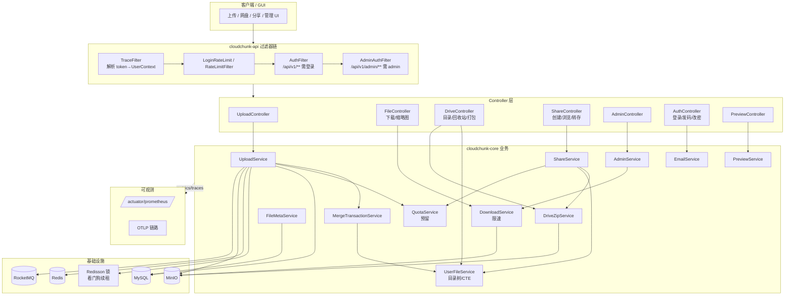

# CloudChunk 整体架构

## 系统架构图

```
┌─────────────────────────────────────────────────────────────────────┐
│                           Browser (React 18)                        │
│  ┌──────────┐  ┌──────────┐  ┌──────────┐  ┌────────────────────┐  │
│  │ Web Worker│  │ IndexedDB│  │ fetch API│  │ WebSocket Client   │  │
│  │ (hash-wasm)│ │(hash缓存)│  │(分片上传) │  │(实时进度推送)      │  │
│  └─────┬─────┘  └─────┬────┘  └───┬──────┘  └─────────┬──────────┘  │
└────────┼──────────────┼───────────┼────────────────────┼────────────┘
         │              │           │                    │
    ┌────▼──────────────▼───────────▼────────────────────▼─────────┐
    │                   Tomcat NIO (Virtual Threads)                │
    │  ┌──────────────────────────────────────────────────────┐    │
    │  │                cloudchunk-api                         │    │
    │  │  UploadController │ FileController │ TranscodeController│  │
    │  │  TraceFilter      │ RateLimitFilter│ WebSocket Handler  │  │
    │  └──────────────────────────────────────────────────────┘    │
    │  ┌──────────────────────────────────────────────────────┐    │
    │  │                cloudchunk-core                        │    │
    │  │  UploadService  │ FileMetaService  │ DownloadService  │    │
    │  │  ProgressStore  │ ChecksumService  │ QuotaService     │    │
    │  │  MergeTransactionService │ StaleSessionCleanupTask    │    │
    │  └──────────────────────────────────────────────────────┘    │
    │  ┌─────────────┐  ┌─────────────┐  ┌─────────────────────┐  │
    │  │cloudchunk-  │  │cloudchunk-  │  │cloudchunk-          │  │
    │  │  storage    │  │  infra      │  │  mq                 │  │
    │  │StorageStrat.│  │RedisLock    │  │TranscodeProducer    │  │
    │  │MinIO impl   │  │RateLimiter  │  │ChecksumProducer     │  │
    │  └──────┬──────┘  └──────┬──────┘  └──────┬──────────────┘  │
    └─────────┼───────────────┼────────────────┼──────────────────┘
              │               │                │
    ┌─────────▼──┐  ┌────────▼───┐  ┌─────────▼──────────┐
    │   MinIO    │  │   Redis    │  │    RocketMQ        │
    │ (对象存储) │  │ (缓存/锁/  │  │  (异步消息)        │
    │            │  │  进度/限流) │  │                    │
    └────────────┘  └────────────┘  └─────────┬──────────┘
                                              │
                                    ┌─────────▼──────────┐
                                    │cloudchunk-transcode │
                                    │ ImageConsumer       │
                                    │ VideoConsumer       │
                                    │ DocConsumer         │
                                    │ DlqConsumer         │
                                    └────────────────────┘
              ┌────────────┐
              │   MySQL    │
              │ (元数据/   │
              │  会话/配额) │
              └────────────┘
```

## 模块依赖关系

```
cloudchunk-boot (启动模块)
  ├── cloudchunk-api        (REST 接口层)
  │     ├── cloudchunk-core     (业务核心)
  │     │     ├── cloudchunk-storage  (存储抽象)
  │     │     ├── cloudchunk-infra    (Redis 基础设施)
  │     │     └── cloudchunk-mq       (消息队列)
  │     └── cloudchunk-common   (公共枚举/工具/异常)
  └── cloudchunk-transcode  (转码消费者)
        ├── cloudchunk-core
        └── cloudchunk-common
```

## 核心数据流

| 链路 | 路径 | 关键组件 |
|------|------|----------|
| 分片上传 | Browser → Controller → UploadService → MinIO | ProgressStore(Redis), ChunkRecord(MySQL) |
| 直传上传 | Browser → MinIO (presigned PUT) → Controller(confirm) | StorageStrategy.presignUpload() |
| 秒传 | Browser → Controller → FileMetaService(MD5查询) | Redis SETNX 幂等锁 |
| 合并 | Controller → UploadService.merge() → MinIO ComposeObject | MergeTransactionService, RedisLock |
| 校验 | RocketMQ → ChecksumConsumer → ChecksumService | MD5 流式校验 |
| 转码 | RocketMQ → Image/Video/DocConsumer → MinIO | FFmpeg, Thumbnailator, Tika |
| 下载 | Controller → DownloadService → MinIO presign/getRange | Caffeine + Redis 两级缓存，令牌桶限速 |
| 网盘目录 | DriveController → UserFileService → user_file(MySQL) | 目录树/回收站，递归子树用 MySQL8 CTE |
| 打包下载 | DriveController → DriveZipService → MinIO(逐对象流) → ZipOutputStream | zip-slip 消毒、批量 findByFileIds、流式恒定内存 |
| 分享 | ShareController → ShareService → file_share(MySQL) | 提取码常量时间校验、公开浏览子树越权防护、递归转存 |
| 配额预留 | init/加入会话 → QuotaService.tryConsume(原子 UPDATE) | 准入即预留、合并不重复、取消/过期释放 |
| 管理端 | AdminController(+AdminAuthFilter) → AdminService | role 鉴权、用户/文件/系统设置、越权下载 |
| 邮箱验证 | AuthController → EmailService → email_verification(MySQL) + SMTP | SETNX 限流、10 分钟过期、dev 模式仅记录 |

---

## 扩展架构（对齐 Go 版的新增能力）

在原有分片上传/转码/下载之上，补齐了网盘目录树、分享、管理端、邮箱验证、预览，
并把配额改为「预留模型」、分布式锁升级 Redisson、加入 Prometheus/OpenTelemetry 可观测。



### 新增 / 变更模块清单

| 域 | 关键类 | 表 | 说明 |
|----|--------|----|------|
| 网盘 | `UserFileService` / `DriveController` / `RecycleBinController` | `user_file` | 目录树、回收站（递归子树用 CTE），上传/秒传落盘 |
| 打包 | `DriveZipService` | — | 批量/文件夹 ZIP 流式下载，zip-slip 消毒 + 去重 + 目录环保护 |
| 分享 | `ShareService` / `ShareController` | `file_share` | 提取码、公开浏览、打包/直连下载、递归转存 |
| 管理 | `AdminService` / `AdminController` / `AdminAuthFilter` / `AdminSeeder` | `system_setting` + `user_account.role` | 用户/文件/设置管理；管理员种子默认关闭，需显式配置 |
| 邮箱 | `EmailService` / `Mailer` | `email_verification` | 验证码注册/找回/换绑，SMTP + dev 日志 |
| 预览 | `PreviewService` / `PreviewController` | — | 按 mime 聚合预览信息 + 缩略图端点 |
| 配额 | `QuotaService.tryConsume` / `UserQuotaMapper.tryAddUsed` | `user_quota` | 预留模型（原子 UPDATE，防 TOCTOU 超额） |
| 锁 | `RedisLock`(Redisson) | — | 看门狗自动续租，崩溃自动释放 |
| 限速 | `RateLimitedInputStream` + `DownloadService` | — | 令牌桶，`download_speed_limit` 热更新生效 |
| 可观测 | Actuator + Micrometer Prometheus + OTel | — | `/actuator/prometheus`、OTLP 链路（采样可配） |

> 详见 `06-drive-share-quota-flow.md`（网盘/分享/配额预留数据流详解，含时序图）。
