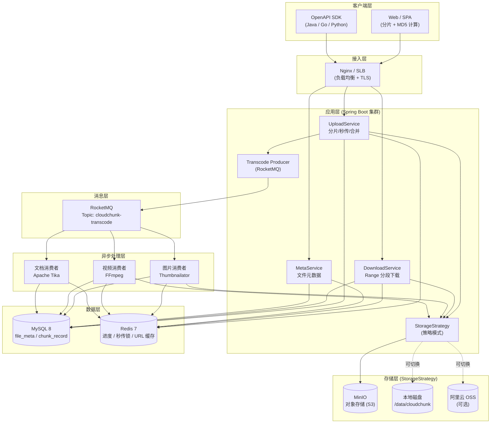
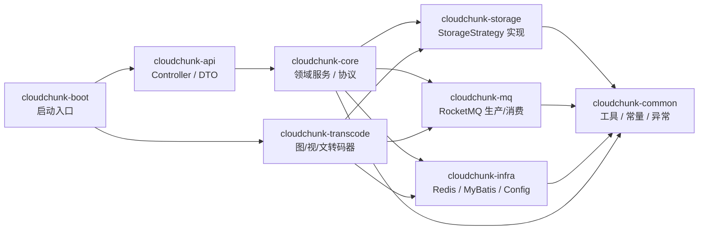
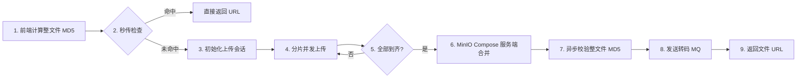
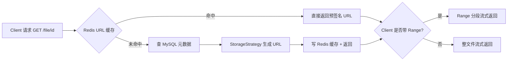
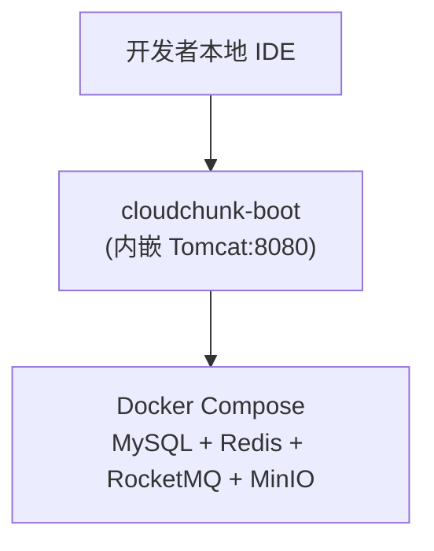
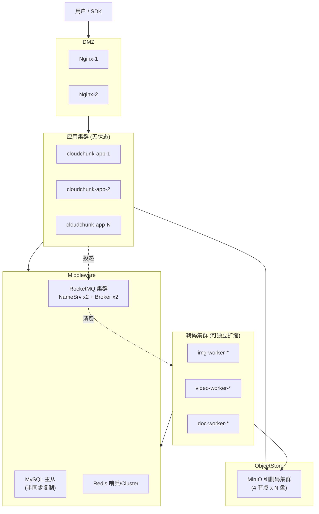

# 01 · 架构设计

> 本文档描述 CloudChunk 的整体架构、模块划分、技术选型与部署拓扑。

---

## 1. 设计目标

| 维度 | 目标 |
|------|------|
| **可靠性** | 断点续传成功率 > 99%，合并后整文件 MD5 强校验 |
| **吞吐量** | 单节点支持 GB 级文件稳定上传，上传链路与转码解耦 |
| **扩展性** | 存储后端可插拔（MinIO / 本地 / OSS），应用层可水平扩展 |
| **低延迟** | 上传接口 TP99 ≤ 200 ms（不含分片传输），秒传查询 ≤ 20 ms |
| **节约成本** | MD5 秒传去重 ≈ 35%，服务端 Compose 合并不经应用层带宽 |

---

## 2. 整体架构图

---

## 3. 分层说明

### 3.1 客户端层
- 负责**分片切割**、**MD5 计算**、**并发上传控制**
- 推荐使用 `spark-md5` 或 `Web Crypto API` 增量计算 MD5，避免一次性加载大文件

### 3.2 接入层
- Nginx / SLB 做 TLS 终结、负载均衡、限流
- 建议配置 `client_max_body_size 10m`（略大于分片 5MB，留余量）

### 3.3 应用层
| 组件 | 职责 |
|------|------|
| `UploadService` | 初始化上传会话、接收分片、写 Redis 进度、触发合并 |
| `DownloadService` | 签发 URL、Range 分段下载、校验访问权限 |
| `MetaService` | 文件元数据 CRUD、秒传查询 |
| `TranscodeProducer` | 合并成功后投递 RocketMQ 消息 |
| `StorageStrategy` | 对外统一的存储抽象接口（见 [05 存储策略](./05-storage-strategy.md)） |

### 3.4 消息层
- **RocketMQ** 作为异步解耦骨干
- Topic：
  - `cloudchunk-transcode`（转码任务分发）
  - `cloudchunk-checksum`（合并后异步整文件 MD5 校验）
  - `cloudchunk-broken`（损坏通知，前端可订阅）
- 使用 **TAG** 按文件类型路由：`img` / `video` / `doc`

### 3.5 异步处理层
- 多个独立消费者组，按需扩缩容
- 图片：Thumbnailator 生成 3 档缩略图
- 视频：FFmpeg 转 H.264 + 抽首帧封面
- 文档：Apache Tika 提取纯文本 + Summary

### 3.6 数据层
- **MySQL** 存持久化元数据、分片记录
- **Redis** 存：
  - 分片上传进度 Hash
  - 秒传幂等锁（SETNX）
  - 热点文件下载 URL 缓存（LRU）

### 3.7 存储层
- 默认 **MinIO**（S3 兼容，可私有化）
- 策略模式可切换**本地磁盘**（开发 / 单机部署）、**阿里云 OSS**（公有云）

---

## 4. 模块拆分（Maven 多模块）

详见 [08 工程结构](./08-project-structure.md)。

---

## 5. 关键流程鸟瞰

### 5.1 上传主流程（概览）

**详细时序图** → [04 分片上传协议](./04-chunk-upload-protocol.md)

### 5.2 下载主流程（概览）

---

## 6. 部署拓扑

### 6.1 开发 / 单机

### 6.2 生产集群（参考）

**扩展策略**：
- 应用层**无状态**，所有会话数据在 Redis，水平扩容只需加节点
- 转码集群**独立部署**，CPU/GPU 密集型，可按文件类型独立扩缩
- MinIO **纠删码集群**提供数据冗余，无单点

---

## 7. 技术选型理由

| 选型 | 理由 |
|------|------|
| **Java 21** | 虚拟线程（Virtual Thread）原生支持，I/O 密集型上传/下载并发优势明显 |
| **Spring Boot 3.3** | 生态成熟，Starter 机制降低集成成本 |
| **MyBatis-Plus** | 代码生成 + Lambda 查询 + 分页插件，个人项目开发效率高 |
| **MinIO** | S3 兼容、支持 Compose Object 服务端合并、可私有化 |
| **RocketMQ** | 事务消息 + 顺序消息 + 死信队列，国产化友好 |
| **Redis Hash** | `HSET/HGET` 天然适合存储 `{chunkIndex: status}`，单命令原子 |

---

## 8. 非功能性约束

| 约束 | 说明 |
|------|------|
| **安全** | 上传/下载需鉴权；预签名 URL 默认 30 分钟过期 |
| **配额** | 用户级配额表 `user_quota`，上传前预检查 |
| **审计** | 所有写操作落审计日志表 `op_log`（可选接 ELK） |
| **监控** | Micrometer + Prometheus，关键指标见 [07 部署](./07-deployment.md) |
| **灰度** | 基于 `cloudchunk.storage.type` 配置灰度切流 |

---

## 9. 风险与权衡

| 风险点 | 缓解措施 |
|--------|----------|
| 整文件 MD5 前端计算慢（大文件） | 改用流式计算库，或退化为分片 MD5 累加（牺牲部分秒传命中率） |
| Compose Object 单次分片数限制（MinIO ≤ 10000 / S3 ≤ 10000） | 分片大小保底 5MB，单文件上限约 50GB；超限走**分批 Compose** |
| Redis 进度数据丢失 | TTL 24h + 兜底扫 MinIO 已存在分片重建进度 |
| RocketMQ 消息积压 | 消费者线程池可调、Worker 独立扩缩容、死信队列告警 |
| 大文件 MD5 异步校验期间用户已下载 | 合并完成先置 `status=merged`，校验后再 `status=available`；前置拦截 |

---

## 10. 后续演进

- [ ] 引入 **分片级幂等**：分片重复上传直接返回已有 ETag
- [ ] 支持 **预签名直传**：客户端直传 MinIO，绕过应用层
- [ ] 增加 **冷热分层**：低频文件自动迁移至归档存储
- [ ] 接入 **CDN**：下载链路走 CDN 回源 MinIO
- [ ] **多租户**：按租户隔离 Bucket / 配额 / 鉴权
