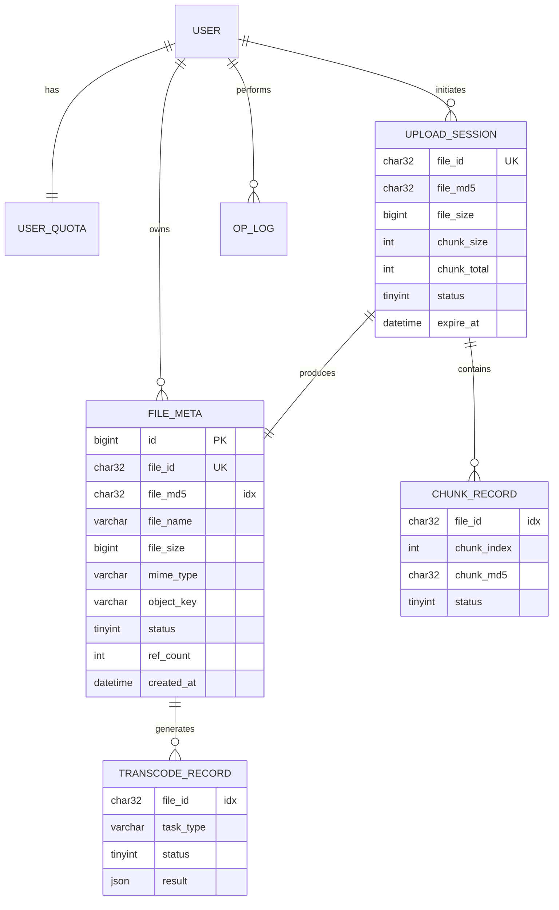

# 02 · 数据库与缓存设计

> 本文档定义 MySQL 表结构、索引策略，以及 Redis Key 规范。

---

## 1. MySQL Schema

### 1.1 总览

| 表名 | 用途 | 量级预估 |
|------|------|----------|
| `file_meta` | 文件元数据主表（秒传核心） | 百万~千万级 |
| `chunk_record` | 分片记录（仅用于持久化兜底，热数据在 Redis） | 千万级 |
| `upload_session` | 上传会话（初始化后 24h 过期） | 百万级（带 TTL 清理） |
| `user_quota` | 用户存储配额 | 与用户数量等级 |
| `transcode_record` | 转码任务记录与结果 | 百万级 |
| `op_log` | 操作审计日志 | 千万级（建议按月分表） |

### 1.2 `file_meta` — 文件元数据

```sql
CREATE TABLE `file_meta` (
  `id`            BIGINT UNSIGNED NOT NULL AUTO_INCREMENT COMMENT '主键',
  `file_id`       CHAR(32)        NOT NULL COMMENT '业务文件 ID (UUID 无横线)',
  `file_md5`      CHAR(32)        NOT NULL COMMENT '整文件 MD5 (秒传主键)',
  `file_name`     VARCHAR(512)    NOT NULL COMMENT '原始文件名',
  `file_size`     BIGINT UNSIGNED NOT NULL COMMENT '文件大小 (byte)',
  `mime_type`     VARCHAR(128)    NOT NULL COMMENT 'MIME 类型',
  `ext`           VARCHAR(16)     DEFAULT NULL COMMENT '扩展名',
  `storage_type`  VARCHAR(16)     NOT NULL DEFAULT 'minio' COMMENT '存储类型 minio|local|oss',
  `bucket`        VARCHAR(64)     NOT NULL COMMENT '桶名',
  `object_key`    VARCHAR(512)    NOT NULL COMMENT '对象 key',
  `status`        TINYINT         NOT NULL DEFAULT 0 COMMENT '0=上传中 1=已合并 2=已校验(可用) 3=损坏 4=已删除',
  `transcode_status` TINYINT      NOT NULL DEFAULT 0 COMMENT '0=未转码 1=转码中 2=成功 3=失败 4=不需要',
  `thumbnail_url` VARCHAR(512)    DEFAULT NULL COMMENT '缩略图/封面 URL',
  `extra`         JSON            DEFAULT NULL COMMENT '扩展字段: 视频分辨率/时长/文档摘要',
  `owner_id`      BIGINT UNSIGNED NOT NULL COMMENT '所属用户 ID',
  `ref_count`     INT UNSIGNED    NOT NULL DEFAULT 1 COMMENT '秒传引用计数',
  `created_at`    DATETIME(3)     NOT NULL DEFAULT CURRENT_TIMESTAMP(3),
  `updated_at`    DATETIME(3)     NOT NULL DEFAULT CURRENT_TIMESTAMP(3) ON UPDATE CURRENT_TIMESTAMP(3),
  `deleted_at`    DATETIME(3)     DEFAULT NULL COMMENT '逻辑删除',
  PRIMARY KEY (`id`),
  UNIQUE KEY `uk_file_id` (`file_id`),
  KEY `idx_md5_status` (`file_md5`, `status`),
  KEY `idx_owner_created` (`owner_id`, `created_at`),
  KEY `idx_status_transcode` (`status`, `transcode_status`)
) ENGINE=InnoDB DEFAULT CHARSET=utf8mb4 COMMENT='文件元数据';
```

**设计要点**：
- `file_md5 + status` 联合索引为**秒传查询**主路径：`WHERE file_md5=? AND status=2`
- `ref_count` 记录引用数，秒传命中 +1，删除 -1；等于 0 才真正清理对象
- `extra` JSON 存异构扩展字段（如视频的 duration/resolution），避免频繁加列
- `deleted_at` 逻辑删除，配合定时任务物理清理

### 1.3 `chunk_record` — 分片持久化记录

> Redis 是**主存**，此表是**兜底**：Redis 异常时从此表重建进度。

```sql
CREATE TABLE `chunk_record` (
  `id`          BIGINT UNSIGNED NOT NULL AUTO_INCREMENT,
  `file_id`     CHAR(32)        NOT NULL COMMENT '上传会话的 fileId',
  `chunk_index` INT UNSIGNED    NOT NULL COMMENT '分片序号 0-based',
  `chunk_md5`   CHAR(32)        NOT NULL COMMENT '分片 MD5',
  `chunk_size`  INT UNSIGNED    NOT NULL COMMENT '分片大小',
  `etag`        VARCHAR(64)     DEFAULT NULL COMMENT 'MinIO 返回的 ETag',
  `status`      TINYINT         NOT NULL DEFAULT 0 COMMENT '0=待上传 1=已完成 2=失败',
  `created_at`  DATETIME(3)     NOT NULL DEFAULT CURRENT_TIMESTAMP(3),
  `updated_at`  DATETIME(3)     NOT NULL DEFAULT CURRENT_TIMESTAMP(3) ON UPDATE CURRENT_TIMESTAMP(3),
  PRIMARY KEY (`id`),
  UNIQUE KEY `uk_file_chunk` (`file_id`, `chunk_index`),
  KEY `idx_file_status` (`file_id`, `status`)
) ENGINE=InnoDB DEFAULT CHARSET=utf8mb4 COMMENT='分片记录';
```

### 1.4 `upload_session` — 上传会话

```sql
CREATE TABLE `upload_session` (
  `id`          BIGINT UNSIGNED NOT NULL AUTO_INCREMENT,
  `file_id`     CHAR(32)        NOT NULL COMMENT '会话 ID',
  `file_md5`    CHAR(32)        NOT NULL COMMENT '整文件 MD5',
  `file_name`   VARCHAR(512)    NOT NULL,
  `file_size`   BIGINT UNSIGNED NOT NULL,
  `chunk_size`  INT UNSIGNED    NOT NULL COMMENT '分片大小 byte',
  `chunk_total` INT UNSIGNED    NOT NULL COMMENT '分片总数',
  `owner_id`    BIGINT UNSIGNED NOT NULL,
  `status`      TINYINT         NOT NULL DEFAULT 0 COMMENT '0=进行中 1=合并中 2=完成 3=失败 4=过期',
  `bucket`      VARCHAR(64)     NOT NULL,
  `object_key`  VARCHAR(512)    NOT NULL,
  `expire_at`   DATETIME        NOT NULL COMMENT '会话过期时间',
  `created_at`  DATETIME(3)     NOT NULL DEFAULT CURRENT_TIMESTAMP(3),
  `updated_at`  DATETIME(3)     NOT NULL DEFAULT CURRENT_TIMESTAMP(3) ON UPDATE CURRENT_TIMESTAMP(3),
  PRIMARY KEY (`id`),
  UNIQUE KEY `uk_file_id` (`file_id`),
  KEY `idx_md5` (`file_md5`),
  KEY `idx_owner_expire` (`owner_id`, `expire_at`),
  KEY `idx_status_expire` (`status`, `expire_at`)
) ENGINE=InnoDB DEFAULT CHARSET=utf8mb4 COMMENT='上传会话';
```

### 1.5 `user_quota` — 用户配额

```sql
CREATE TABLE `user_quota` (
  `user_id`     BIGINT UNSIGNED NOT NULL COMMENT '用户 ID',
  `total_bytes` BIGINT UNSIGNED NOT NULL DEFAULT 0 COMMENT '配额上限',
  `used_bytes`  BIGINT UNSIGNED NOT NULL DEFAULT 0 COMMENT '已用',
  `file_count`  INT UNSIGNED    NOT NULL DEFAULT 0,
  `updated_at`  DATETIME(3)     NOT NULL DEFAULT CURRENT_TIMESTAMP(3) ON UPDATE CURRENT_TIMESTAMP(3),
  PRIMARY KEY (`user_id`)
) ENGINE=InnoDB DEFAULT CHARSET=utf8mb4 COMMENT='用户配额';
```

### 1.6 `transcode_record` — 转码任务

```sql
CREATE TABLE `transcode_record` (
  `id`           BIGINT UNSIGNED NOT NULL AUTO_INCREMENT,
  `file_id`      CHAR(32)        NOT NULL,
  `task_type`    VARCHAR(16)     NOT NULL COMMENT 'image|video|doc',
  `status`       TINYINT         NOT NULL DEFAULT 0 COMMENT '0=排队 1=执行中 2=成功 3=失败',
  `retry_count`  INT UNSIGNED    NOT NULL DEFAULT 0,
  `result`       JSON            DEFAULT NULL COMMENT '转码产物列表',
  `error_msg`    VARCHAR(1024)   DEFAULT NULL,
  `started_at`   DATETIME(3)     DEFAULT NULL,
  `finished_at`  DATETIME(3)     DEFAULT NULL,
  `created_at`   DATETIME(3)     NOT NULL DEFAULT CURRENT_TIMESTAMP(3),
  PRIMARY KEY (`id`),
  KEY `idx_file_id` (`file_id`),
  KEY `idx_status_type` (`status`, `task_type`)
) ENGINE=InnoDB DEFAULT CHARSET=utf8mb4 COMMENT='转码任务记录';
```

### 1.7 `op_log` — 审计日志

```sql
CREATE TABLE `op_log` (
  `id`         BIGINT UNSIGNED NOT NULL AUTO_INCREMENT,
  `user_id`    BIGINT UNSIGNED DEFAULT NULL,
  `op_type`    VARCHAR(32)     NOT NULL COMMENT 'UPLOAD|DOWNLOAD|DELETE|MERGE|TRANSCODE',
  `target_id`  VARCHAR(64)     DEFAULT NULL COMMENT 'fileId',
  `ip`         VARCHAR(64)     DEFAULT NULL,
  `ua`         VARCHAR(512)    DEFAULT NULL,
  `params`     JSON            DEFAULT NULL,
  `result`     TINYINT         NOT NULL COMMENT '0=失败 1=成功',
  `cost_ms`    INT UNSIGNED    NOT NULL DEFAULT 0,
  `created_at` DATETIME(3)     NOT NULL DEFAULT CURRENT_TIMESTAMP(3),
  PRIMARY KEY (`id`),
  KEY `idx_user_time` (`user_id`, `created_at`),
  KEY `idx_op_time` (`op_type`, `created_at`)
) ENGINE=InnoDB DEFAULT CHARSET=utf8mb4 COMMENT='操作审计日志';
```

---

## 2. 实体关系



---

## 3. Redis Key 规范

### 3.1 命名规范

`cc:{biz}:{sub_biz}:{id}`

- `cc` = CloudChunk 固定前缀
- 所有 Key **必须设置 TTL**（除 URL 缓存走 LRU 外）

### 3.2 Key 清单

| Key | 类型 | TTL | 用途 | 示例 |
|-----|------|-----|------|------|
| `cc:upload:progress:{fileId}` | Hash | 24h | 分片上传进度 `{chunkIndex: "1"}` | HSET cc:upload:progress:abc 0 1 |
| `cc:upload:session:{fileId}` | Hash | 24h | 会话元信息（冗余 MySQL 加速读） | HMSET cc:upload:session:abc md5 ... |
| `cc:upload:lock:{md5}` | String (SETNX) | 10min | 秒传并发幂等锁 | SET cc:upload:lock:xxx 1 NX EX 600 |
| `cc:upload:merge-lock:{fileId}` | String (SETNX) | 5min | 合并操作分布式锁 | SET cc:upload:merge-lock:abc 1 NX EX 300 |
| `cc:file:url:{fileId}` | String | 30min | 下载预签名 URL 缓存 | - |
| `cc:file:meta:{fileId}` | Hash | 1h | 文件元数据热缓存 | - |
| `cc:file:md5:{md5}` | String | 1h | md5 → fileId 反查（秒传加速） | - |
| `cc:rate:upload:{userId}` | String | 1h | 上传限流计数（滑窗） | - |
| `cc:transcode:retry:{fileId}` | String | 1h | 转码重试次数（幂等 key） | - |

### 3.3 热点缓存策略

| 数据 | 策略 | 原因 |
|------|------|------|
| 下载 URL | **Cache-Aside** + LRU | URL 有效期 30min，频繁访问 |
| 文件元数据 | **Cache-Aside**，更新时 Delete | 强一致要求 |
| MD5 → fileId | **Cache-Aside** | 秒传场景读多写少 |
| 分片进度 | **Redis as Primary** | MySQL 仅兜底 |

### 3.4 进度 Hash 结构示例

```
HGETALL cc:upload:progress:a1b2c3d4e5f6
1) "0"   2) "1"        # 分片 0 已完成
3) "1"   2) "1"        # 分片 1 已完成
5) "2"   6) "0"        # 分片 2 待上传
7) "3"   8) "1"
9) "total" 10) "10"
11) "md5"  12) "..."
```

> 约定：`field = chunkIndex` 时 `value = "1"/"0"`；保留字段 `total` / `md5` / `size` 存元信息。

---

## 4. 索引策略

| 查询场景 | SQL 片段 | 命中索引 |
|----------|----------|----------|
| 秒传查询 | `WHERE file_md5=? AND status=2` | `idx_md5_status` |
| 用户文件列表（按时间倒序分页） | `WHERE owner_id=? ORDER BY created_at DESC` | `idx_owner_created` |
| 转码扫描（未处理任务） | `WHERE status=1 AND transcode_status=0` | `idx_status_transcode` |
| 分片查询 | `WHERE file_id=? ORDER BY chunk_index` | `uk_file_chunk` |
| 过期会话清理 | `WHERE status=0 AND expire_at<NOW()` | `idx_status_expire` |

**反模式警示**：
- **不要**在 `file_md5` 单列建索引而用 `SELECT *`，回表成本高；改用**覆盖索引** `(file_md5, status, file_id, object_key, file_size)` 可进一步优化高 QPS 秒传场景（权衡写放大后决定）。

---

## 5. 分库分表建议（远期）

| 表 | 拆分键 | 策略 |
|----|--------|------|
| `file_meta` | `owner_id` | 按用户 Hash 分 16 库 x 64 表 |
| `chunk_record` | `file_id` | Hash 分 8 库 x 16 表 |
| `op_log` | `created_at` | 按月分表 `op_log_yyyyMM` |

当前 MVP 阶段**不做拆分**，仅做索引优化 + 读写分离即可。

---

## 6. 一致性模型

| 场景 | 一致性要求 | 实现 |
|------|------------|------|
| 上传分片 → Redis 进度 | 最终一致（Redis 主，MySQL 兜底） | 分片上传后先写 Redis，异步落 MySQL |
| 合并 → `file_meta.status` | 强一致 | 事务内：插入 `file_meta` + 删除 `upload_session` |
| 秒传命中 → `ref_count + 1` | 强一致 | `UPDATE file_meta SET ref_count = ref_count + 1 WHERE ...` |
| 转码完成 → 元数据更新 | 最终一致 | Worker 幂等写入 + 缓存失效 |
| 删除文件 → `ref_count - 1` | 强一致 | 等于 0 才触发对象真实删除（异步） |

---

## 7. 初始化脚本目录

```
deploy/sql/
├── schema.sql          # 全部表结构
├── seed.sql            # 示例数据（dev 环境）
└── migration/          # Flyway 版本化迁移
    ├── V1__init.sql
    └── V2__add_transcode_record.sql
```
