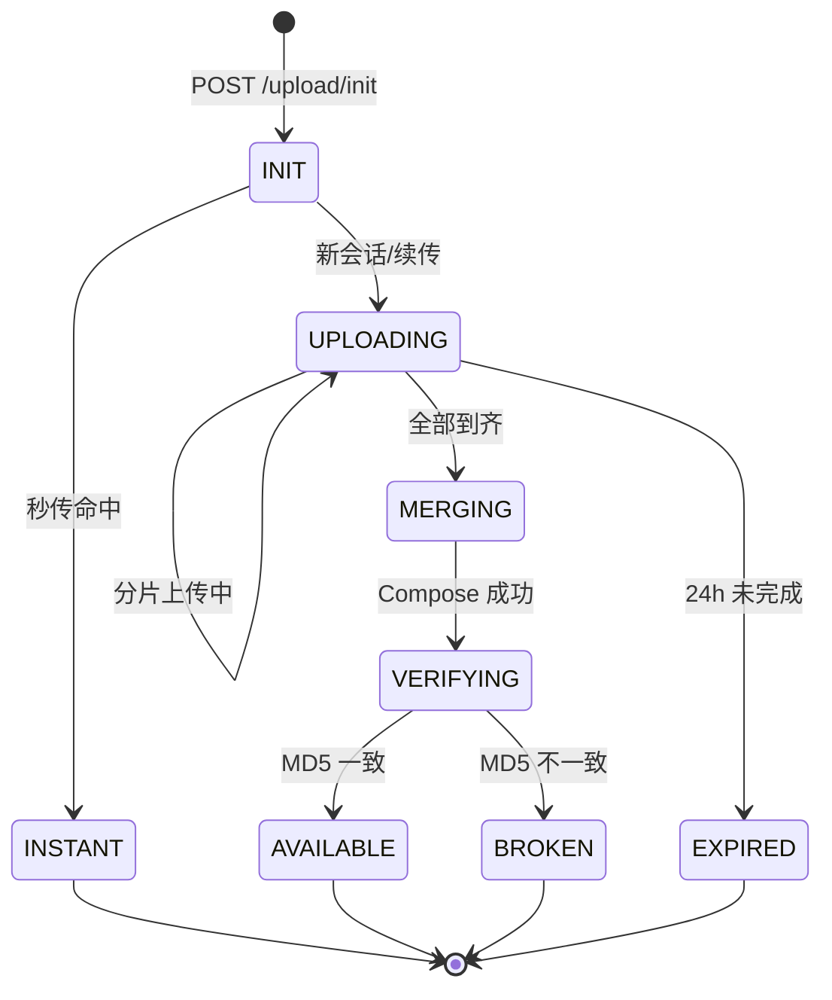
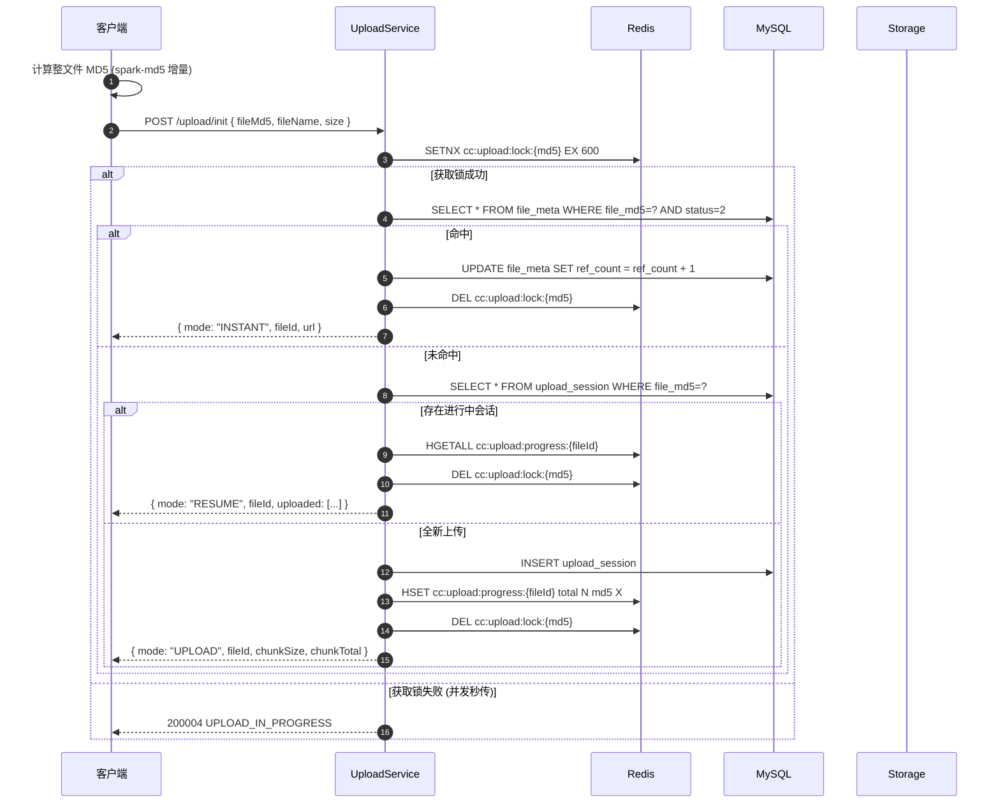
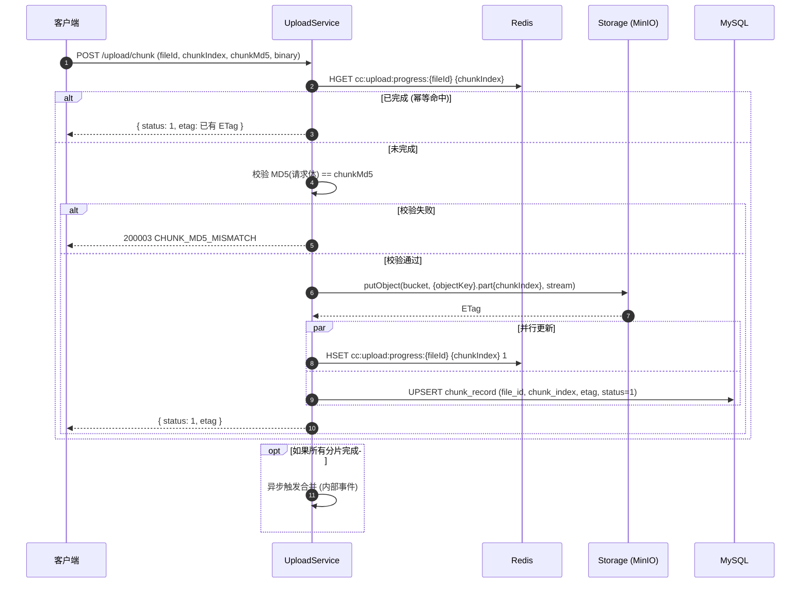
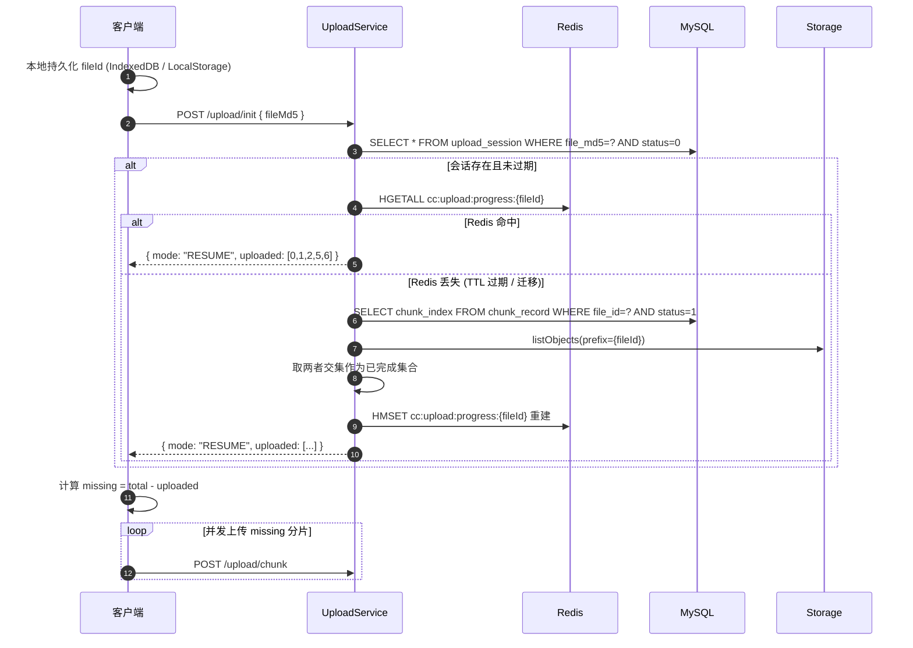
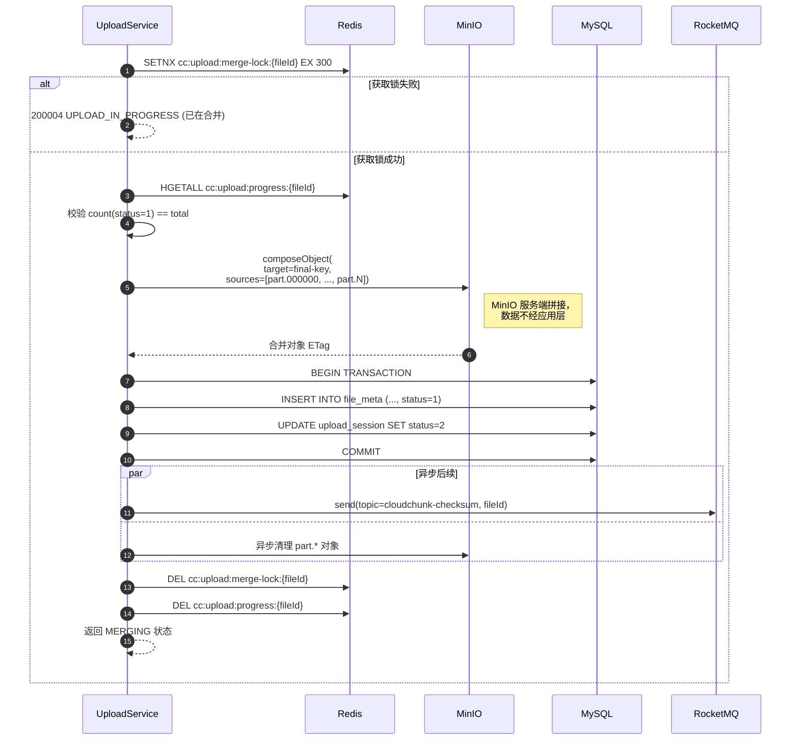
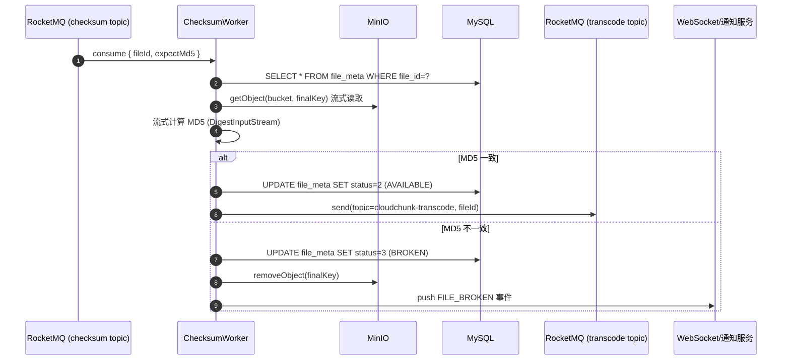
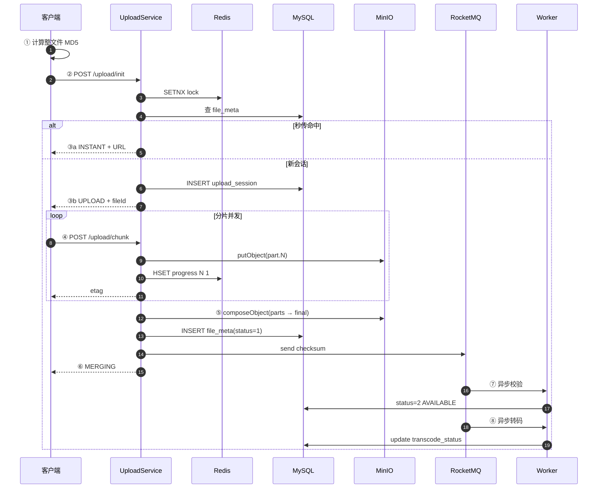

# 04 · 分片上传协议

> 本文档是 CloudChunk **最核心**的协议设计，涵盖秒传、分片上传、断点续传、服务端合并、异步校验五个环节。

---

## 1. 协议总览



| 状态 | 含义 | `file_meta.status` |
|------|------|--------------------|
| INIT | 会话已创建，等待分片 | — |
| UPLOADING | 分片上传进行中 | 0 |
| MERGING | 已触发合并 | 1 |
| VERIFYING | 合并完成，异步校验中 | 1 |
| AVAILABLE | 整文件 MD5 一致，可用 | 2 |
| BROKEN | 校验失败，标记损坏 | 3 |
| INSTANT | 秒传命中，未经物理上传 | 2 |

---

## 2. 秒传（Instant Upload）

### 2.1 流程



### 2.2 幂等控制

- **场景**：用户同时从两个 Tab 上传同一文件 → 两次 `/upload/init` 并发
- **问题**：不加锁会产生两条 `upload_session`，最终合并时重复落 `file_meta`
- **方案**：Redis `SETNX cc:upload:lock:{md5} EX 600`
- **释放**：初始化结束立即 DEL；异常情况靠 TTL 10min 自动过期

### 2.3 MD5 计算优化

- **前端**：`spark-md5` 增量计算，分块读取 `FileReader.readAsArrayBuffer`，避免 OOM
- **大文件降级**：文件 > 1 GB 时，默认改为**分片 MD5 级联**（`MD5(md5_0 | md5_1 | ...)`），牺牲秒传命中率换取客户端性能
- **后端校验**：合并完成后异步计算整文件 MD5 兜底（见 §6）

---

## 3. 分片上传

### 3.1 前端切片算法

```text
chunkSize   = 10 MB (当前默认，可配置 1~200 MB；建议不低于 5 MB)
chunkTotal  = ceil(fileSize / chunkSize)
for i in [0, chunkTotal):
    chunk   = file.slice(i * chunkSize, (i+1) * chunkSize)
    chunkMd5 = MD5(chunk)
    POST /upload/chunk { fileId, chunkIndex: i, chunkMd5, chunk }
```

**并发控制**：前端使用 **Promise Pool** 限制并发（建议 4~6 路），避免浏览器连接瓶颈与后端压力。

### 3.2 单分片上传时序



### 3.3 分片命名规范

为便于 Compose 与清理，分片对象采用统一 key：

```
{bucket}/upload/{yyyyMMdd}/{fileId}/part.{chunkIndex:06d}
例: cloudchunk/upload/20250101/a1b2c3.../part.000042
```

合并完成后**最终对象**迁移至：
```
{bucket}/{yyyy}/{MM}/{dd}/{fileId}/{fileName}
例: cloudchunk/2025/01/01/a1b2c3.../demo.mp4
```

### 3.4 分片 MD5 校验

- **必做**：服务端接收分片后立即计算 MD5，与 `chunkMd5` 比对
- 失败则直接 `200003 CHUNK_MD5_MISMATCH`，不写 Redis，不占 MinIO 对象
- 前端收到后重传当前分片（**单分片重传**，不影响其他分片）

---

## 4. 断点续传

### 4.1 触发条件

- 浏览器刷新 / 关闭后重新打开
- 网络中断后恢复
- 显式点击"继续上传"

### 4.2 流程



### 4.3 Redis 兜底重建算法

```java
// 伪代码
Set<Integer> rebuildProgress(String fileId) {
    // 1. MySQL 侧
    List<ChunkRecord> dbChunks = chunkRecordMapper
        .select(fileId, ChunkStatus.DONE);
    Set<Integer> dbIndexes = dbChunks.stream()
        .map(ChunkRecord::getChunkIndex).collect(toSet());

    // 2. MinIO 侧（防止 MySQL 未落盘的边界情况）
    Set<Integer> storageIndexes = storage
        .listPartObjects(fileId)
        .stream().map(this::parseIndex).collect(toSet());

    // 3. 取交集（两边都有才算真的完成）
    Set<Integer> confirmed = Sets.intersection(dbIndexes, storageIndexes);

    // 4. 回填 Redis
    redis.hmset("cc:upload:progress:" + fileId,
        confirmed.stream().collect(toMap(i -> i.toString(), i -> "1")));
    redis.expire("cc:upload:progress:" + fileId, 24, HOURS);

    return confirmed;
}
```

### 4.4 过期处理

- `upload_session.expire_at` 默认 **24 小时**
- 定时任务每小时扫描 `status=0 AND expire_at < NOW()` 的会话：
  1. 置 `status=4`（过期）
  2. 清理 MinIO 中 `upload/*/fileId/*` 前缀对象
  3. 删除 Redis 进度 Key（若还存在）
  4. 删除 `chunk_record`

---

## 5. 服务端合并

### 5.1 触发条件

- **隐式触发**：最后一个分片上传成功后，判断已完成数 == 总数则自动触发
- **显式触发**：前端调 `POST /upload/merge/{fileId}`（幂等）

### 5.2 合并时序



### 5.3 MinIO Compose Object 细节

- MinIO SDK：`ComposeObjectArgs` 支持最多 **10,000** 个源对象
- 每个源对象 **最小 5 MB**（最后一个除外），因此分片配置建议不低于 5 MB；当前开发配置默认 10 MB
- 超过 10,000 分片 → **分批 Compose**：先拼合成中间对象，再二次拼合
- Java SDK 示例：

```java
List<ComposeSource> sources = IntStream.range(0, total)
    .mapToObj(i -> ComposeSource.builder()
        .bucket(bucket)
        .object(partKey(fileId, i))
        .build())
    .toList();

minioClient.composeObject(
    ComposeObjectArgs.builder()
        .bucket(bucket)
        .object(finalKey)
        .sources(sources)
        .build());
```

### 5.4 合并失败处理

| 失败类型 | 处理 |
|----------|------|
| 分片数量不够 | 返回当前 uploaded，等前端重传缺失分片 |
| 某分片在 MinIO 被删 | 从 `uploaded` 移除该索引，前端重传 |
| MinIO 服务异常 | 置 `session.status=合并失败标记`，前端可重试 |
| 超时（> 5min） | 合并锁自动释放，前端可再次调 `/upload/merge` |

---

## 6. 异步整文件校验

> 为什么异步：合并一个 50 GB 文件后计算 MD5 需要数分钟，不能阻塞用户返回。

### 6.1 流程



### 6.2 流式 MD5 计算

```java
try (InputStream in = storage.download(bucket, finalKey);
     DigestInputStream dis = new DigestInputStream(in, MessageDigest.getInstance("MD5"))) {
    byte[] buf = new byte[1024 * 1024]; // 1 MB buffer
    while (dis.read(buf) != -1) { /* just read */ }
    byte[] digest = dis.getMessageDigest().digest();
    return Hex.encodeHexString(digest);
}
```

关键点：
- **不加载整文件到内存**
- 使用 **1 MB buffer** 平衡吞吐与 GC 压力
- 校验时避免占用大量虚拟线程：专用线程池 `checksum-pool`（默认 4 路）

---

## 7. 完整端到端时序（快速参考）



---

## 8. 异常矩阵

| 异常 | 恢复策略 |
|------|----------|
| 网络断开 | 前端指数退避重试单分片，最多 3 次 |
| 分片 MD5 不一致 | 当前分片重传 |
| 整文件 MD5 不一致 | 文件标记 BROKEN + 通知重传 + 清理对象 |
| Redis 宕机恢复后进度丢失 | MySQL + MinIO 交集兜底重建 |
| 合并过程中应用重启 | 合并锁 TTL 过期后，前端可重新触发 |
| 会话 24h 未完成 | 定时任务清理，前端收到 `200001` 提示重新上传 |
| MinIO 单分片丢失 | 该分片标记未完成，前端重传；只合并现有完整分片在分片完整前不会触发 |

---

## 9. 性能考虑

| 优化点 | 说明 |
|--------|------|
| **分片并发度 4~6** | 经验值，避免浏览器连接上限 6/domain 被吃满 |
| **分片大小默认 10 MB** | 满足 MinIO Compose 非末尾源对象最小 5 MB 约束；过小会放大元数据开销 |
| **虚拟线程** | 上传接口 I/O 密集，Java 21 Virtual Thread 显著降内存 |
| **Redis pipeline** | 合并前 `HGETALL` + 后续 `DEL` 合并一次 RTT |
| **MySQL batch insert** | `chunk_record` 批量写（合并前兜底落表） |
| **Compose 异步清理 parts** | 合并成功后触发清理，不阻塞响应 |
