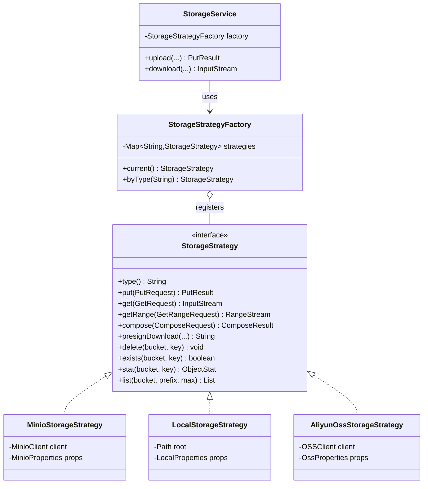
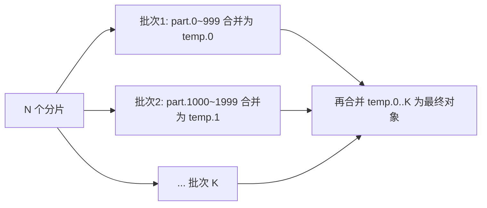
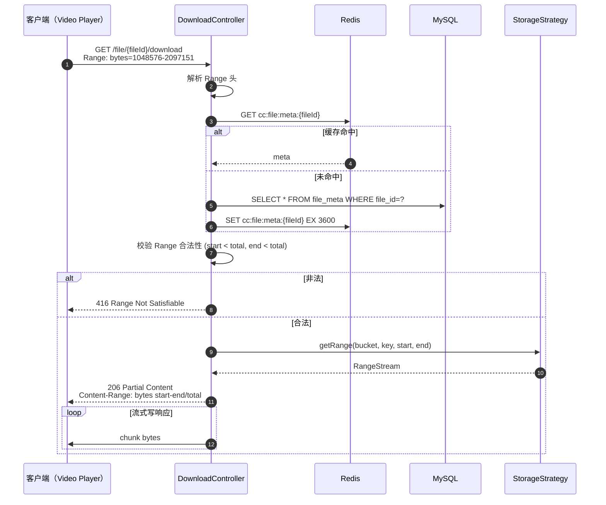

# 05 · 存储策略

> 本文档描述 `StorageStrategy` 抽象、三种内置实现（MinIO / 本地 / 阿里云 OSS）以及 Range 下载实现细节。

---

## 1. 设计动机

| 场景 | 需求 |
|------|------|
| 开发调试 | 本地文件系统，无需启动 MinIO |
| 私有化部署 | MinIO（S3 兼容、可集群） |
| 公有云部署 | 阿里云 OSS / 腾讯云 COS / AWS S3 |
| 灰度 / 迁移 | 通过配置一键切换，业务代码零改动 |

→ 采用 **策略模式 + SPI** 抽象存储后端。

---

## 2. 接口定义

### 2.1 `StorageStrategy` 核心接口

```java
package com.cloudchunk.storage;

public interface StorageStrategy {

    /** 存储类型标识，如 "minio" / "local" / "oss" */
    String type();

    /** 上传对象 */
    PutResult put(PutRequest request);

    /** 下载对象（流式） */
    InputStream get(GetRequest request);

    /** Range 下载 */
    RangeStream getRange(GetRangeRequest request);

    /** 服务端合并（不经应用层） */
    ComposeResult compose(ComposeRequest request);

    /** 生成预签名下载 URL */
    String presignDownload(String bucket, String objectKey, Duration ttl);

    /** 生成预签名上传 URL（可选，用于客户端直传） */
    String presignUpload(String bucket, String objectKey, Duration ttl);

    /** 删除对象 */
    void delete(String bucket, String objectKey);

    /** 批量删除 */
    void deleteBatch(String bucket, List<String> keys);

    /** 对象是否存在 */
    boolean exists(String bucket, String objectKey);

    /** 对象元数据 */
    ObjectStat stat(String bucket, String objectKey);

    /** 列举对象（按前缀） */
    List<ObjectStat> list(String bucket, String prefix, int maxKeys);
}
```

### 2.2 DTO 定义

```java
public record PutRequest(
    String bucket,
    String objectKey,
    InputStream stream,
    long size,
    String contentType,
    Map<String, String> userMetadata
) {}

public record PutResult(
    String objectKey,
    String etag,
    long size
) {}

public record GetRangeRequest(
    String bucket,
    String objectKey,
    long start,   // 闭区间
    long end      // 闭区间，-1 表示到结尾
) {}

public record RangeStream(
    InputStream stream,
    long start,
    long end,
    long total
) implements AutoCloseable {
    @Override public void close() throws IOException { stream.close(); }
}

public record ComposeRequest(
    String bucket,
    String targetKey,
    List<String> sourceKeys   // 必须有序
) {}

public record ComposeResult(
    String targetKey,
    String etag,
    long totalSize
) {}

public record ObjectStat(
    String bucket,
    String objectKey,
    long size,
    String etag,
    Instant lastModified,
    String contentType,
    Map<String, String> userMetadata
) {}
```

### 2.3 类图



---

## 3. 工厂与配置

### 3.1 Spring Boot 配置

```yaml
cloudchunk:
  storage:
    type: minio    # minio | local | oss
    default-bucket: cloudchunk
    presign-ttl: PT30M
    minio:
      endpoint: http://minio.local:9000
      access-key: ${MINIO_AK}
      secret-key: ${MINIO_SK}
      region: cn-east-1
      secure: false
    local:
      root: /data/cloudchunk
      base-url: https://files.example.com
    oss:
      endpoint: oss-cn-hangzhou.aliyuncs.com
      access-key-id: ${OSS_AK}
      access-key-secret: ${OSS_SK}
      internal: true
```

### 3.2 工厂实现

```java
@Component
public class StorageStrategyFactory {

    private final Map<String, StorageStrategy> strategies;
    private final String currentType;

    public StorageStrategyFactory(List<StorageStrategy> all,
                                  @Value("${cloudchunk.storage.type}") String type) {
        this.strategies = all.stream()
            .collect(toMap(StorageStrategy::type, identity()));
        this.currentType = type;
    }

    public StorageStrategy current() {
        return byType(currentType);
    }

    public StorageStrategy byType(String type) {
        StorageStrategy s = strategies.get(type);
        if (s == null) {
            throw new StorageException("未知存储类型: " + type);
        }
        return s;
    }
}
```

### 3.3 按类型 `@ConditionalOnProperty` 自动注入

```java
@Configuration
@ConditionalOnProperty(prefix = "cloudchunk.storage", name = "type", havingValue = "minio", matchIfMissing = true)
@EnableConfigurationProperties(MinioProperties.class)
public class MinioStorageAutoConfiguration {
    @Bean
    public StorageStrategy minioStorageStrategy(MinioProperties props) {
        return new MinioStorageStrategy(buildClient(props), props);
    }
}
```

同理还有 `LocalStorageAutoConfiguration` / `AliyunOssStorageAutoConfiguration`，按 `type` 值激活。

---

## 4. MinIO 实现要点

### 4.1 客户端初始化

```java
MinioClient client = MinioClient.builder()
    .endpoint(props.getEndpoint())
    .credentials(props.getAccessKey(), props.getSecretKey())
    .region(props.getRegion())
    .build();
```

### 4.2 Compose Object

```java
@Override
public ComposeResult compose(ComposeRequest req) {
    if (req.sourceKeys().size() > 10_000) {
        return composeInBatches(req);   // 分批合并
    }
    List<ComposeSource> sources = req.sourceKeys().stream()
        .map(k -> ComposeSource.builder()
            .bucket(req.bucket()).object(k).build())
        .toList();

    ObjectWriteResponse resp = client.composeObject(
        ComposeObjectArgs.builder()
            .bucket(req.bucket())
            .object(req.targetKey())
            .sources(sources)
            .build());

    StatObjectResponse stat = client.statObject(
        StatObjectArgs.builder().bucket(req.bucket()).object(req.targetKey()).build());

    return new ComposeResult(req.targetKey(), resp.etag(), stat.size());
}
```

### 4.3 分批合并（>10000 分片）



### 4.4 预签名 URL

```java
@Override
public String presignDownload(String bucket, String key, Duration ttl) {
    return client.getPresignedObjectUrl(
        GetPresignedObjectUrlArgs.builder()
            .method(Method.GET)
            .bucket(bucket)
            .object(key)
            .expiry((int) ttl.toSeconds())
            .build());
}
```

---

## 5. 本地磁盘实现要点

### 5.1 Key 映射

```
bucket/prefix/2025/01/01/fileId/demo.mp4
↓
/data/cloudchunk/bucket/prefix/2025/01/01/fileId/demo.mp4
```

### 5.2 Compose（`FileChannel.transferTo`）

```java
@Override
public ComposeResult compose(ComposeRequest req) {
    Path target = resolve(req.bucket(), req.targetKey());
    Files.createDirectories(target.getParent());
    try (FileChannel out = FileChannel.open(target, CREATE, TRUNCATE_EXISTING, WRITE)) {
        long position = 0;
        for (String srcKey : req.sourceKeys()) {
            Path src = resolve(req.bucket(), srcKey);
            try (FileChannel in = FileChannel.open(src, READ)) {
                long size = in.size();
                long transferred = 0;
                while (transferred < size) {
                    transferred += in.transferTo(transferred, size - transferred, out);
                }
                position += size;
            }
        }
        return new ComposeResult(req.targetKey(), computeEtag(target), position);
    }
}
```

### 5.3 预签名 URL（简单方案）

本地存储无 S3 签名，返回**业务网关签发的临时 token URL**：
```
https://files.example.com/local/{bucket}/{key}?token={JWT}&exp={ts}
```
下载时由 `DownloadController` 校验 token 合法性后直接 `Files.newInputStream` 流返回。

---

## 6. 阿里云 OSS 实现要点

- 使用 `aliyun-sdk-oss` 3.x
- `OSSClient.copyObject` + `UploadPartCopy` 可实现类似 Compose 的效果
- 超过 1GB 单对象 Compose 建议走 **Multipart Copy**（分片拷贝到同一个 UploadId）
- 预签名：`OSSClient.generatePresignedUrl(bucket, key, expiration)`

---

## 7. Range 分段下载

### 7.1 HTTP Range 规范（RFC 7233）

请求头：
```
Range: bytes=0-1048575          # 首 1 MB
Range: bytes=1048576-            # 从 1 MB 到结尾
Range: bytes=-500                # 末尾 500 字节
Range: bytes=0-100, 200-300      # 多段（本项目仅支持单段）
```

响应头：
```
HTTP/1.1 206 Partial Content
Accept-Ranges: bytes
Content-Range: bytes 0-1048575/73741824
Content-Length: 1048576
Content-Type: video/mp4
```

非法 Range 返回 `416 Range Not Satisfiable`，并带：
```
Content-Range: bytes */73741824
```

### 7.2 时序



### 7.3 Spring Boot 实现

```java
@GetMapping("/file/{fileId}/download")
public void download(@PathVariable String fileId,
                     @RequestHeader(value = "Range", required = false) String range,
                     HttpServletResponse resp) throws IOException {

    FileMeta meta = fileService.getAvailableOrThrow(fileId);
    long total = meta.getFileSize();

    RangeSpec spec = RangeSpec.parse(range, total);   // 解析/校验
    if (!spec.valid()) {
        resp.setStatus(HttpStatus.REQUESTED_RANGE_NOT_SATISFIABLE.value());
        resp.setHeader("Content-Range", "bytes */" + total);
        return;
    }

    try (RangeStream rs = storage.current().getRange(
            new GetRangeRequest(meta.getBucket(), meta.getObjectKey(), spec.start(), spec.end()))) {

        resp.setStatus(spec.isFull() ? 200 : 206);
        resp.setContentType(meta.getMimeType());
        resp.setHeader("Accept-Ranges", "bytes");
        resp.setHeader("Content-Length", String.valueOf(rs.end() - rs.start() + 1));
        if (!spec.isFull()) {
            resp.setHeader("Content-Range",
                "bytes " + rs.start() + "-" + rs.end() + "/" + total);
        }
        resp.setHeader("Content-Disposition",
            "attachment; filename=\"" + urlEncode(meta.getFileName()) + "\"");

        rs.stream().transferTo(resp.getOutputStream());
    }
}
```

### 7.4 RangeSpec 解析

```java
public record RangeSpec(long start, long end, boolean valid, boolean isFull) {

    public static RangeSpec full(long total) {
        return new RangeSpec(0, total - 1, true, true);
    }

    public static RangeSpec parse(String header, long total) {
        if (header == null || header.isBlank()) return full(total);
        if (!header.startsWith("bytes=")) return new RangeSpec(0, 0, false, false);

        String[] parts = header.substring(6).split("-", 2);
        long start, end;
        try {
            if (parts[0].isEmpty()) {                         // bytes=-500
                long suffix = Long.parseLong(parts[1]);
                start = Math.max(total - suffix, 0);
                end = total - 1;
            } else if (parts.length == 1 || parts[1].isEmpty()) { // bytes=500-
                start = Long.parseLong(parts[0]);
                end = total - 1;
            } else {                                          // bytes=0-1023
                start = Long.parseLong(parts[0]);
                end = Math.min(Long.parseLong(parts[1]), total - 1);
            }
        } catch (NumberFormatException e) {
            return new RangeSpec(0, 0, false, false);
        }

        if (start < 0 || start > end || start >= total) {
            return new RangeSpec(0, 0, false, false);
        }
        return new RangeSpec(start, end, true, false);
    }
}
```

---

## 8. 下载 URL 缓存（LRU）

### 8.1 方案

| 选型 | 说明 |
|------|------|
| **Caffeine 本地缓存** | 应用内 LRU，读命中 0 RTT，但多节点不一致 |
| **Redis 缓存** | 多节点一致，但多一次 RTT |
| **两级缓存（L1 Caffeine + L2 Redis）** | 最佳实践，本项目采用 |

### 8.2 缓存 Key

- `cc:file:url:{fileId}` → 预签名 URL 字符串
- TTL：`min(presignTtl, 30min)`；写缓存时 TTL 小于预签名 5 分钟（避免返回已过期 URL）

### 8.3 更新时机

- **文件删除**：立即 DEL 缓存
- **转码完成**（可能更新 object_key）：立即 DEL
- **预签名到期前 5 min**：主动失效 + 重新生成

---

## 9. 切换与灰度

### 9.1 配置切换

```yaml
cloudchunk:
  storage:
    type: ${STORAGE_TYPE:minio}
```

重启生效。

### 9.2 双写灰度（迁移场景）

```java
@Component
@ConditionalOnProperty("cloudchunk.storage.migrate.enabled")
public class DualWriteStorageStrategy implements StorageStrategy {
    private final StorageStrategy primary;    // 新
    private final StorageStrategy secondary;  // 旧

    public PutResult put(PutRequest req) {
        PutResult r = primary.put(req);
        // 异步双写旧存储
        migrateExecutor.execute(() -> secondary.put(req));
        return r;
    }

    public InputStream get(GetRequest req) {
        try { return primary.get(req); }
        catch (NotFoundException e) { return secondary.get(req); }  // 回源
    }
    // ...
}
```

---

## 10. 异常与降级

| 异常 | 降级策略 |
|------|----------|
| 存储后端不可达 | 上传接口直接返回 `500001 STORAGE_UNAVAILABLE`，触发熔断 |
| 预签名失败 | 降级为代理下载（应用层 stream 透传），告警 |
| Compose 失败 | 记录错误 + 重试（指数退避，最多 3 次），仍失败则置 `session.status=失败` |
| 空间不足 | 上传前 `stat bucket` 检查，超限返回 `500002 STORAGE_INSUFFICIENT` |
