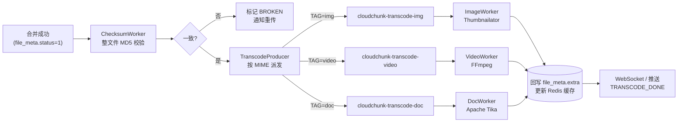
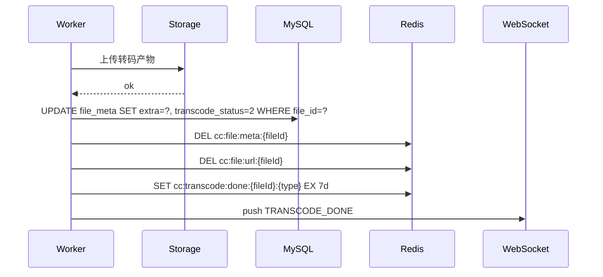

# 06 · 异步转码管道

> 本文档描述基于 RocketMQ 的异步转码管道：消息协议、三类消费者（图/视/文）、重试与幂等、结果回写。

---

## 1. 为什么异步

| 问题 | 同步做法的痛点 | 异步方案 |
|------|----------------|----------|
| 视频转码耗时数分钟 | 阻塞上传接口，TP99 爆炸 | MQ 解耦，上传链路 TP99 ≤ 200 ms |
| 转码失败不应影响文件可用性 | 失败就回滚，用户要重传 | 原文件已可用，转码失败只影响缩略图/转码产物 |
| 转码 CPU 密集，不能与 IO 共享线程池 | 转码压垮 I/O 线程 | Worker 独立部署，独立资源 |
| 高峰期流量削峰 | 直接拒绝 | MQ 堆积消费 |

---

## 2. 管道总览



---

## 3. Topic / Tag / Group 规范

| Topic | Tag | Producer Group | Consumer Group | 说明 |
|-------|-----|----------------|----------------|------|
| `cloudchunk-checksum` | — | `PG-checksum` | `CG-checksum` | 合并后整文件 MD5 校验 |
| `cloudchunk-transcode` | `img` / `video` / `doc` | `PG-transcode` | `CG-transcode-img` / `CG-transcode-video` / `CG-transcode-doc` | 转码分发 |
| `cloudchunk-broken` | — | `PG-broken` | `CG-broken-notify` | 文件损坏通知 |
| `cloudchunk-dlq` | — | — | — | 所有消费组的死信队列（RocketMQ 默认 `%DLQ%`） |

消费者通过 **Tag 过滤订阅**，仅拉取感兴趣的消息。

---

## 4. 消息协议

### 4.1 统一消息体

```json
{
  "msgId": "b1f2c3d4-xxxx",
  "fileId": "a1b2c3d4e5f6",
  "eventType": "TRANSCODE",
  "mimeType": "video/mp4",
  "bucket": "cloudchunk",
  "objectKey": "2025/01/01/a1b2c3.../demo.mp4",
  "fileSize": 1073741824,
  "expectMd5": "d41d8cd98f00b204e9800998ecf8427e",
  "retryCount": 0,
  "producedAt": "2025-01-01T12:00:00.000Z",
  "traceId": "trace-xxxxx"
}
```

### 4.2 Key 设计

- 使用 `fileId` 作为 RocketMQ **消息 Key**，方便按 Key 查询消息
- 同文件去重：生产端发送前检查 `cc:transcode:sent:{fileId}`（SETNX EX 300），避免重复投递

---

## 5. 生产者

### 5.1 实现

```java
@Component
@RequiredArgsConstructor
public class TranscodeProducer {

    private final RocketMQTemplate template;
    private final StringRedisTemplate redis;

    public void publish(FileMeta meta) {
        String sendLockKey = "cc:transcode:sent:" + meta.getFileId();
        Boolean first = redis.opsForValue().setIfAbsent(sendLockKey, "1", Duration.ofMinutes(5));
        if (!Boolean.TRUE.equals(first)) {
            log.debug("skip duplicated transcode produce: {}", meta.getFileId());
            return;
        }

        String tag = resolveTag(meta.getMimeType());
        if (tag == null) {
            // 未识别的 MIME 类型，置 transcode_status=4 (不需要转码)
            fileMetaMapper.updateTranscodeStatus(meta.getFileId(), TranscodeStatus.SKIP);
            return;
        }

        TranscodeMessage msg = TranscodeMessage.from(meta);
        template.syncSend("cloudchunk-transcode:" + tag,
            MessageBuilder.withPayload(msg)
                .setHeader(MessageConst.PROPERTY_KEYS, meta.getFileId())
                .setHeader(MessageConst.PROPERTY_TAGS, tag)
                .build(),
            3000L); // 3s 超时
    }

    private String resolveTag(String mime) {
        if (mime == null) return null;
        if (mime.startsWith("image/")) return "img";
        if (mime.startsWith("video/")) return "video";
        if (mime.startsWith("application/pdf")
         || mime.startsWith("application/msword")
         || mime.startsWith("application/vnd.openxmlformats-officedocument")
         || mime.startsWith("text/")) return "doc";
        return null;
    }
}
```

### 5.2 触发时机

- `ChecksumWorker` MD5 校验通过后发送
- 管理员手动 `POST /transcode/{fileId}/retry` 也走此入口（`retryCount` 递增）

---

## 6. 消费者通用模板

```mermaid
flowchart TD
    A[收到消息] --> B{幂等检查<br/>cc:transcode:done:{fileId}:{type}}
    B -- 已处理 --> Z[ACK 结束]
    B -- 未处理 --> C[update transcode_record<br/>status=RUNNING]
    C --> D{业务处理}
    D -- 成功 --> E[上传产物<br/>写 file_meta.extra<br/>DEL cc:file:meta:{fileId}]
    E --> F[set cc:transcode:done:...]
    F --> G[ACK]
    D -- 可重试异常 --> H{retryCount < 3?}
    H -- 是 --> I[RECONSUME_LATER<br/>RocketMQ 按延迟重投]
    H -- 否 --> J[写入死信队列<br/>status=FAILED + 告警]
    D -- 不可重试 --> J
```

### 6.1 幂等 Key

- `cc:transcode:done:{fileId}:{taskType}`
- SET EX 7 天；重启/迁移后可从 `transcode_record.status=SUCCESS` 重建

### 6.2 通用抽象

```java
public abstract class AbstractTranscodeConsumer<T extends TranscodeMessage>
        implements RocketMQListener<T> {

    @Autowired protected FileMetaMapper fileMetaMapper;
    @Autowired protected TranscodeRecordMapper recordMapper;
    @Autowired protected StorageStrategyFactory storage;
    @Autowired protected StringRedisTemplate redis;

    @Override
    public void onMessage(T msg) {
        String doneKey = "cc:transcode:done:" + msg.getFileId() + ":" + taskType();
        if (Boolean.TRUE.equals(redis.hasKey(doneKey))) {
            return; // 幂等命中
        }

        TranscodeRecord record = recordMapper.startRunning(msg.getFileId(), taskType());
        try {
            TranscodeResult result = doTranscode(msg);

            // 写元数据
            fileMetaMapper.appendExtra(msg.getFileId(), result.toJson());
            fileMetaMapper.updateTranscodeStatus(msg.getFileId(), TranscodeStatus.SUCCESS);
            recordMapper.finishSuccess(record.getId(), result.toJson());

            // 缓存失效
            redis.delete("cc:file:meta:" + msg.getFileId());
            redis.delete("cc:file:url:" + msg.getFileId());
            redis.opsForValue().set(doneKey, "1", Duration.ofDays(7));

            notifyService.push(msg.getFileId(), "TRANSCODE_DONE", result);
        } catch (RetryableException re) {
            recordMapper.incRetry(record.getId(), re.getMessage());
            throw re;     // 抛出触发 RocketMQ 重投
        } catch (Exception e) {
            recordMapper.finishFailed(record.getId(), e.getMessage());
            fileMetaMapper.updateTranscodeStatus(msg.getFileId(), TranscodeStatus.FAILED);
            // 不抛出：交给下游死信策略处理
        }
    }

    protected abstract String taskType();
    protected abstract TranscodeResult doTranscode(T msg) throws Exception;
}
```

---

## 7. 图片转码 — ImageWorker

### 7.1 职责

- 生成 **3 档缩略图**：`s(200x200)` / `m(600x600)` / `l(1200x1200)`
- 提取 EXIF（如有）写入 `extra.exif`
- 主色提取（可选，用于占位图）

### 7.2 实现（Thumbnailator）

```java
@RocketMQMessageListener(
    topic = "cloudchunk-transcode",
    selectorExpression = "img",
    consumerGroup = "CG-transcode-img",
    consumeThreadNumber = 8)
public class ImageTranscodeConsumer extends AbstractTranscodeConsumer<TranscodeMessage> {

    private static final int[] SIZES = { 200, 600, 1200 };
    private static final String[] LABELS = { "s", "m", "l" };

    @Override protected String taskType() { return "image"; }

    @Override
    protected TranscodeResult doTranscode(TranscodeMessage msg) throws Exception {
        StorageStrategy s = storage.current();
        try (InputStream in = s.get(new GetRequest(msg.getBucket(), msg.getObjectKey()))) {
            BufferedImage origin = ImageIO.read(in);
            if (origin == null) throw new RetryableException("not a valid image");

            List<ThumbResult> thumbs = new ArrayList<>();
            for (int i = 0; i < SIZES.length; i++) {
                ByteArrayOutputStream bos = new ByteArrayOutputStream();
                Thumbnails.of(origin)
                    .size(SIZES[i], SIZES[i])
                    .keepAspectRatio(true)
                    .outputFormat("jpg")
                    .outputQuality(0.85)
                    .toOutputStream(bos);

                byte[] bytes = bos.toByteArray();
                String key = thumbKey(msg.getObjectKey(), LABELS[i]);
                s.put(new PutRequest(msg.getBucket(), key,
                    new ByteArrayInputStream(bytes), bytes.length, "image/jpeg", Map.of()));
                thumbs.add(new ThumbResult(LABELS[i], key, SIZES[i]));
            }

            return TranscodeResult.builder()
                .type("image")
                .thumbnails(thumbs)
                .width(origin.getWidth())
                .height(origin.getHeight())
                .build();
        }
    }
}
```

---

## 8. 视频转码 — VideoWorker

### 8.1 职责

- 转成 **H.264 + AAC** 统一格式（兼容性最佳）
- 抽取首帧作为**封面**
- 提取元数据：`duration`, `resolution`, `codec`, `bitrate`
- 可选：多码率自适应（HLS / DASH），MVP 阶段不做

### 8.2 调用 FFmpeg

```java
@Override
protected TranscodeResult doTranscode(TranscodeMessage msg) throws Exception {
    Path workDir = Files.createTempDirectory("vid-");
    Path src = workDir.resolve("src");
    Path dst = workDir.resolve("out.mp4");
    Path cover = workDir.resolve("cover.jpg");

    try {
        // 1. 下载到本地临时文件
        try (InputStream in = storage.current().get(
                new GetRequest(msg.getBucket(), msg.getObjectKey()))) {
            Files.copy(in, src);
        }

        // 2. 抽首帧
        runFFmpeg(List.of(
            "-y", "-i", src.toString(),
            "-ss", "00:00:01", "-frames:v", "1", "-q:v", "3",
            cover.toString()));

        // 3. 转码 H.264
        runFFmpeg(List.of(
            "-y", "-i", src.toString(),
            "-c:v", "libx264", "-preset", "medium", "-crf", "23",
            "-c:a", "aac", "-b:a", "128k",
            "-movflags", "+faststart",
            dst.toString()));

        // 4. 读取探测信息
        VideoProbe probe = ffprobe(src);

        // 5. 上传产物
        String coverKey = msg.getObjectKey().replaceAll("\\.[^.]+$", "") + ".cover.jpg";
        String outKey  = msg.getObjectKey().replaceAll("\\.[^.]+$", "") + ".h264.mp4";
        upload(msg.getBucket(), coverKey, cover, "image/jpeg");
        upload(msg.getBucket(), outKey,  dst,  "video/mp4");

        return TranscodeResult.builder()
            .type("video")
            .coverKey(coverKey)
            .transcodedKey(outKey)
            .duration(probe.duration())
            .resolution(probe.width() + "x" + probe.height())
            .codec("h264")
            .bitrate(probe.bitrate())
            .build();
    } finally {
        FileUtils.deleteQuietly(workDir.toFile());
    }
}

private void runFFmpeg(List<String> args) throws Exception {
    List<String> cmd = new ArrayList<>();
    cmd.add(ffmpegPath);
    cmd.addAll(args);
    Process p = new ProcessBuilder(cmd).redirectErrorStream(true).start();
    if (!p.waitFor(30, TimeUnit.MINUTES)) {
        p.destroyForcibly();
        throw new RetryableException("ffmpeg timeout");
    }
    if (p.exitValue() != 0) {
        throw new RetryableException("ffmpeg exit " + p.exitValue());
    }
}
```

### 8.3 资源约束

| 约束 | 值 |
|------|---|
| 单 Worker 并发转码数 | 2（CPU 密集，视核数调整） |
| 单任务超时 | 30 min |
| 本地临时盘需求 | 至少 3 × 最大文件大小 |
| 消费并发 | `consumeThreadNumber = 2` |

---

## 9. 文档转码 — DocWorker

### 9.1 职责

- 提取纯文本 → 存入 `extra.text_summary`（限制 10 KB）
- 基于文本生成关键词 / Summary（可选，接 NLP）
- 生成首页 PNG 预览（可选，调 LibreOffice headless）

### 9.2 Apache Tika

```java
@Override
protected TranscodeResult doTranscode(TranscodeMessage msg) throws Exception {
    Tika tika = new Tika();
    tika.setMaxStringLength(64 * 1024);      // 最多提取 64KB
    try (InputStream in = storage.current().get(
            new GetRequest(msg.getBucket(), msg.getObjectKey()))) {
        String text = tika.parseToString(in);
        String summary = TextUtils.summarize(text, 500);   // 简单截断
        return TranscodeResult.builder()
            .type("doc")
            .textSummary(summary)
            .textLength(text.length())
            .build();
    }
}
```

---

## 10. 重试与死信

### 10.1 RocketMQ 重试

- 消费失败抛 `RetryableException` → RocketMQ 自动重投
- 默认重试 **16 次**，间隔 `1s / 5s / 10s / 30s / 1m / 2m / 3m / ... / 2h`
- 本项目覆盖为 **3 次**（`consumer.setMaxReconsumeTimes(3)`），失败后进死信

### 10.2 死信队列

- RocketMQ 自动创建 `%DLQ%CG-transcode-img` 等
- 启动一个**死信监听器**：
  - 记录到 `transcode_record` 中 `status=FAILED`
  - 告警到 Prometheus / 钉钉
  - 管理员可 `POST /transcode/{fileId}/retry` 人工重试

### 10.3 手动重试接口

```http
POST /api/v1/transcode/{fileId}/retry
```

- 管理员权限
- 重置 `transcode_record.status=PENDING`, `retry_count=0`
- 重新投递 MQ

---

## 11. 结果回写与缓存失效

### 11.1 写入顺序（保证最终一致）



### 11.2 `extra` JSON 示例

```json
{
  "thumbnails": [
    { "label": "s", "key": ".../img.s.jpg", "size": 200 },
    { "label": "m", "key": ".../img.m.jpg", "size": 600 },
    { "label": "l", "key": ".../img.l.jpg", "size": 1200 }
  ],
  "width": 4032,
  "height": 3024,
  "exif": { "camera": "iPhone 15 Pro", "iso": 100 }
}
```

视频：
```json
{
  "coverKey": ".../video.cover.jpg",
  "transcodedKey": ".../video.h264.mp4",
  "duration": 125.3,
  "resolution": "1920x1080",
  "codec": "h264",
  "bitrate": 4200000
}
```

文档：
```json
{
  "textLength": 23456,
  "textSummary": "本报告介绍了 ..."
}
```

---

## 12. 监控指标

| 指标 | 说明 | 阈值告警 |
|------|------|----------|
| `transcode.queue.size{tag}` | 队列积压 | > 10 000 |
| `transcode.consume.tp99{tag}` | 消费耗时 | video > 30min / img > 10s |
| `transcode.fail.rate{tag}` | 失败率 | > 5% |
| `transcode.dlq.count` | 死信数量 | > 100 |
| `transcode.retry.count` | 重试次数分布 | — |

---

## 13. 扩展能力

- [ ] **HLS 切片**：视频输出 `.m3u8` + `.ts`，支持自适应码率
- [ ] **OCR 识别**：图片转码时顺便做 OCR（Tesseract）
- [ ] **水印**：根据 `owner_id` 生成数字水印
- [ ] **GPU 加速**：FFmpeg NVENC / QSV
- [ ] **文档转 PDF**：通过 LibreOffice headless 统一预览格式
