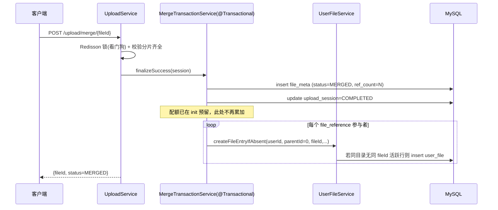
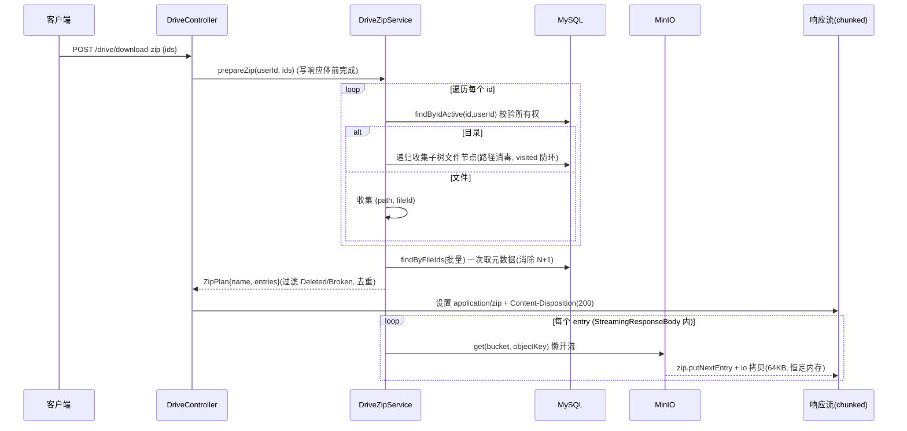
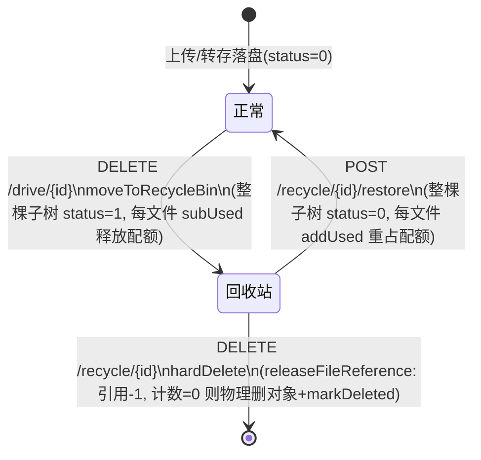
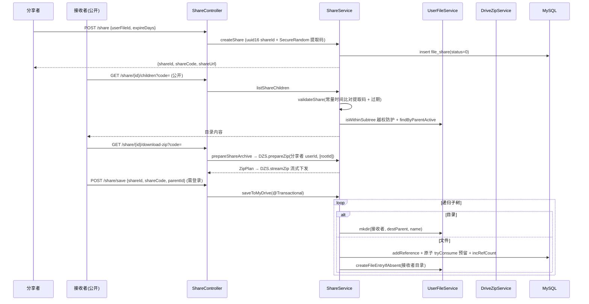
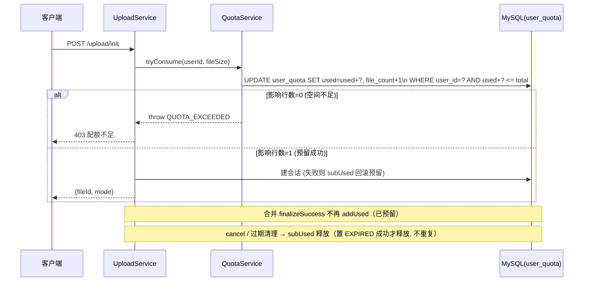

# 链路六：网盘 / 分享 / 配额预留数据流详解

> 本篇覆盖对齐 Go 版后新增的核心链路：网盘目录树与回收站、批量/文件夹 ZIP 打包下载、
> 文件分享（公开浏览 / 打包下载 / 递归转存）、以及把配额从「合并时扣减」改造为
> 「准入即预留」的模型。所有数据流均标注了**数据在哪一层、经过哪些存储**。

---

## 一、文件如何进入网盘（user_file 的产生）

`file_meta` 记录的是**物理对象**（一份 MD5 唯一的文件，可被多人引用）；`user_file` 记录的是
**用户视角的目录树节点**（"我的网盘里第几个目录下有这个文件"）。两者通过 `file_id` 关联。

上传合并成功、或秒传命中时，会为每个参与者在网盘根目录挂一个 `user_file` 条目（幂等）：

秒传路径（`UploadService.init` 命中 `findReusableByMd5`）同理：新增引用 → 原子预留配额 →
`incRefCount` → `createFileEntryIfAbsent` 落盘。

**幂等保证**：`createFileEntryIfAbsent` 先查 `(userId, fileId, status=0)`，同父目录已存在则跳过，
避免合并重试或并发产生重复行（且 merge 全程处于 Redisson 锁内，天然串行）。

---

## 二、批量 / 文件夹 ZIP 打包下载

`POST /api/v1/drive/download-zip {ids:[...]}`：ids 可混合文件与目录，单个目录 id 即整目录打包。

**关键设计**：
- **清单先解析、再写体**：`prepareZip` 只读 DB，参数/权限错误此时抛出，仍走全局异常返回 JSON；
  一旦开始写响应体（chunked）就无法改状态码，故 `streamZip` 内单个坏对象只跳过不中断。
- **两趟批量**：先遍历收集 `(path, fileId)`，再 `findByFileIds` 一次查全部元数据，避免逐文件 N+1。
- **安全 / 健壮**：`sanitize` 消毒每段路径（去 `/ \`、控制字符、纯点名 → 防 zip-slip）；
  `dedupe` 重名加 ` (n)`；`visited` 目录集合防父子环无限递归；条目上限 2 万。

---

## 三、回收站：软删 / 还原 / 彻底删除（递归 + CTE）

删除网盘节点不立即物理删，而是走「回收站」状态机；目录操作按**整棵子树**处理。
子树遍历用 MySQL 8 递归 CTE 一次查完（替代逐层 BFS 的 N+1）。

- `moveToRecycleBin`/`restore` 加 `@Transactional`：状态 + 配额加减原子，中途失败整体回滚。
- 递归遍历 `UserFileMapper.selectSubtree`（`WITH RECURSIVE`）：root 不受 status 过滤、后代按 status，
  与原 BFS 语义一致；异常父子环触发 MySQL 递归深度上限报错而非无限递归。
- `hardDelete` 通过 `releaseFileReference` 按引用计数 GC 物理对象（最后一个引用消失才真正删 MinIO 对象）。

---

## 四、分享：公开浏览 / 打包下载 / 递归转存

分享把某个网盘节点（文件或目录）生成带**提取码**的链接。拥有者操作需登录；
公开访问（`GET /api/v1/share/*`，`/list` 除外）由 `AuthFilter` 放行，但需提取码。

**安全 / 健壮**：
- 提取码用 `MessageDigest.isEqual` **常量时间比较**，防时序侧信道；过期即拒绝。
- 公开浏览用 `isWithinSubtree` 限制在分享子树内，防止用别的 id 越权列目录。
- `saveToMyDrive` 加 `@Transactional`：递归转存中途配额不足时**整棵回滚**（引用/配额/目录行），
  不会留下半保存的目录；且禁止转存自己的分享、校验目标目录归属。
- 打包/直连下载复用 `DriveZipService`，天然继承 zip-slip 消毒、跳过坏文件等保护。

---

## 五、配额预留模型（reservation）——关闭合并 TOCTOU

**旧模型（有竞态）**：init 只 `checkCapacity`（读后比较），合并时才 `addUsed`。两个并发上传可能
都通过检查、都合并、都累加 → 超配额。

**新模型（预留）**：准入（新上传 / 加入会话 / 秒传）即用**原子条件更新**预留空间；合并不再累加；
取消 / 过期释放。

- 原子性来自单条 `UPDATE ... WHERE used_bytes + ? <= total_bytes`（`UserQuotaMapper.tryAddUsed`），
  MySQL 行锁保证并发下"检查+扣减"不可分割，从根上消除 TOCTOU。
- 释放对称：`cancel` 与 `StaleSessionCleanupTask` 用 `subUsed`；清理任务**先原子置 EXPIRED、成功才释放**，
  避免多实例/多轮对同一会话重复释放导致少计。
- 边界：可空 `fileSize` 做空值兜底，避免自动拆箱 NPE。

---

## 六、分布式锁与限速（基础设施升级）

- **Redisson 看门狗锁**：`RedisLock` 底层换 Redisson，`leaseTime=-1` 启用看门狗（默认 30s 租约、
  ~10s 自动续期，直到 unlock）。大文件合并不会中途锁过期；进程崩溃租约到期自动释放，杜绝死锁。
  API 签名不变，调用方零改动。
- **下载令牌桶限速**：`RateLimitedInputStream`（1 秒突发桶、单读上限 256KB、不足即阻塞）包裹下载流；
  `download_speed_limit` 由管理端**热更新**、启动时由 `SettingsInitializer` 加载生效。

---

## 七、可观测

- `/actuator/prometheus`（micrometer-registry-prometheus）暴露 JVM / HTTP / Hikari / Caffeine 指标，
  含 HTTP 时延直方图（Grafana P99）。
- OpenTelemetry 桥接 + OTLP 导出：W3C `traceparent` 传播；默认采样 0（无 collector 不产生导出噪声），
  `TRACING_SAMPLING=1.0` + `OTLP_TRACES_ENDPOINT` 即可开启。日志已带 `%X{traceId}` 便于关联。
