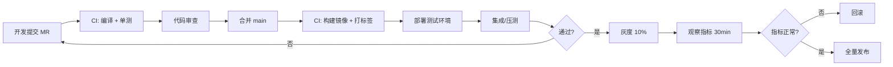

# 07 · 部署与运维

> 本文档描述 CloudChunk 的环境依赖、docker-compose 配置、应用配置、监控告警与容量规划。

---

## 1. 环境依赖清单

| 组件 | 版本 | 用途 | 端口 |
|------|------|------|------|
| JDK | 21+ | 运行时（Virtual Thread） | — |
| Maven | 3.9+ | 构建 | — |
| MySQL | 8.0 | 元数据持久化 | 3306 |
| Redis | 7.x | 缓存 / 进度 / 锁 | 6379 |
| RocketMQ NameServer | 5.x | 注册中心 | 9876 |
| RocketMQ Broker | 5.x | 消息 Broker | 10911 / 10909 |
| MinIO | latest | 对象存储 | 9000 (API) / 9001 (Console) |
| FFmpeg | 6.x | 视频转码 | — |
| LibreOffice (可选) | 7.x | 文档预览 | — |
| Prometheus (可选) | 2.x | 指标收集 | 9090 |
| Grafana (可选) | 10.x | 仪表盘 | 3000 |

---

## 2. docker-compose（一键本地环境）

### 2.1 目录结构

```
deploy/
├── docker-compose.yml
├── .env                 # 环境变量
├── mysql/
│   ├── conf.d/my.cnf
│   └── init/01-schema.sql
├── redis/
│   └── redis.conf
├── rocketmq/
│   ├── broker.conf
│   └── logs/ (运行时挂载)
├── minio/
│   └── data/ (运行时挂载)
└── prometheus/
    ├── prometheus.yml
    └── rules/
```

### 2.2 核心 compose 配置

```yaml
version: "3.9"
name: cloudchunk

networks:
  cloudchunk-net:
    driver: bridge

volumes:
  mysql-data:
  redis-data:
  minio-data:
  rmq-store:

services:
  mysql:
    image: mysql:8.0
    container_name: cc-mysql
    restart: unless-stopped
    environment:
      MYSQL_ROOT_PASSWORD: ${MYSQL_ROOT_PASSWORD:-root}
      MYSQL_DATABASE: cloudchunk
      TZ: Asia/Shanghai
    command: ["--default-authentication-plugin=mysql_native_password",
              "--character-set-server=utf8mb4",
              "--collation-server=utf8mb4_unicode_ci"]
    volumes:
      - mysql-data:/var/lib/mysql
      - ./mysql/conf.d:/etc/mysql/conf.d
      - ./mysql/init:/docker-entrypoint-initdb.d
    ports: ["3306:3306"]
    networks: [cloudchunk-net]
    healthcheck:
      test: ["CMD", "mysqladmin", "ping", "-h", "localhost", "-u", "root",
             "-p${MYSQL_ROOT_PASSWORD:-root}"]
      interval: 10s
      retries: 5

  redis:
    image: redis:7-alpine
    container_name: cc-redis
    restart: unless-stopped
    command: ["redis-server", "/etc/redis/redis.conf"]
    volumes:
      - redis-data:/data
      - ./redis/redis.conf:/etc/redis/redis.conf
    ports: ["6379:6379"]
    networks: [cloudchunk-net]

  rmq-namesrv:
    image: apache/rocketmq:5.2.0
    container_name: cc-rmq-namesrv
    restart: unless-stopped
    command: sh mqnamesrv
    ports: ["9876:9876"]
    networks: [cloudchunk-net]

  rmq-broker:
    image: apache/rocketmq:5.2.0
    container_name: cc-rmq-broker
    restart: unless-stopped
    depends_on: [rmq-namesrv]
    command: sh mqbroker -n cc-rmq-namesrv:9876 -c /home/rocketmq/conf/broker.conf
    volumes:
      - ./rocketmq/broker.conf:/home/rocketmq/conf/broker.conf
      - rmq-store:/home/rocketmq/store
    environment:
      JAVA_OPT_EXT: "-Xms1g -Xmx1g -Xmn512m"
    ports: ["10909:10909", "10911:10911"]
    networks: [cloudchunk-net]

  rmq-dashboard:
    image: apacherocketmq/rocketmq-dashboard:latest
    container_name: cc-rmq-dashboard
    restart: unless-stopped
    depends_on: [rmq-namesrv]
    environment:
      JAVA_OPTS: "-Drocketmq.namesrv.addr=cc-rmq-namesrv:9876"
    ports: ["8180:8080"]
    networks: [cloudchunk-net]

  minio:
    image: minio/minio:latest
    container_name: cc-minio
    restart: unless-stopped
    command: server /data --console-address ":9001"
    environment:
      MINIO_ROOT_USER: ${MINIO_ROOT_USER:-minioadmin}
      MINIO_ROOT_PASSWORD: ${MINIO_ROOT_PASSWORD:-minioadmin}
    volumes:
      - minio-data:/data
    ports:
      - "9000:9000"
      - "9001:9001"
    networks: [cloudchunk-net]
    healthcheck:
      test: ["CMD", "curl", "-f", "http://localhost:9000/minio/health/live"]
      interval: 10s
      retries: 5

  minio-init:
    image: minio/mc:latest
    container_name: cc-minio-init
    depends_on:
      minio:
        condition: service_healthy
    entrypoint: >
      /bin/sh -c "
      mc alias set local http://cc-minio:9000
        ${MINIO_ROOT_USER:-minioadmin} ${MINIO_ROOT_PASSWORD:-minioadmin};
      mc mb -p local/cloudchunk || true;
      mc anonymous set download local/cloudchunk || true;
      "
    networks: [cloudchunk-net]
```

> `rmq-broker` 的 `brokerIP1` 必须配置为宿主机可达地址，否则客户端获取到容器内部 IP 会连不上。

### 2.3 broker.conf 关键配置

```properties
brokerClusterName = DefaultCluster
brokerName = broker-a
brokerId = 0
brokerIP1 = 127.0.0.1
deleteWhen = 04
fileReservedTime = 48
autoCreateTopicEnable = true
# 开启消息跟踪
traceTopicEnable = true
```

### 2.4 一键启动

```bash
# 初次启动
docker compose -f deploy/docker-compose.yml --env-file deploy/.env up -d

# 查看健康
docker compose -f deploy/docker-compose.yml ps

# 停止
docker compose -f deploy/docker-compose.yml down

# 重置数据
docker compose -f deploy/docker-compose.yml down -v
```

---

## 3. 应用配置

### 3.1 Profile 结构

```
cloudchunk-boot/src/main/resources/
├── application.yml              # 公共
├── application-dev.yml          # 开发
├── application-test.yml         # 测试
├── application-prod.yml         # 生产
└── logback-spring.xml
```

### 3.2 `application.yml` 模板

```yaml
server:
  port: 8080
  tomcat:
    max-swallow-size: -1          # 允许大请求体
  compression:
    enabled: true
  forward-headers-strategy: native

spring:
  profiles:
    active: ${SPRING_PROFILES_ACTIVE:dev}
  servlet:
    multipart:
      max-file-size: 10MB         # 单分片上限（5MB + 余量）
      max-request-size: 12MB
  threads:
    virtual:
      enabled: true               # 启用 Java 21 虚拟线程
  datasource:
    url: jdbc:mysql://${MYSQL_HOST:localhost}:3306/cloudchunk?useSSL=false&serverTimezone=Asia/Shanghai&rewriteBatchedStatements=true
    username: ${MYSQL_USER:root}
    password: ${MYSQL_PASSWORD:root}
    hikari:
      maximum-pool-size: 30
      minimum-idle: 5
      connection-timeout: 3000
  data:
    redis:
      host: ${REDIS_HOST:localhost}
      port: 6379
      timeout: 2s
      lettuce:
        pool:
          max-active: 32
          max-idle: 16
          min-idle: 4

mybatis-plus:
  mapper-locations: classpath*:mapper/**/*.xml
  global-config:
    db-config:
      id-type: auto
      logic-delete-field: deletedAt
      logic-delete-value: "NOW()"
      logic-not-delete-value: "NULL"
  configuration:
    map-underscore-to-camel-case: true

rocketmq:
  name-server: ${RMQ_NAMESRV:localhost:9876}
  producer:
    group: PG-cloudchunk
    send-message-timeout: 3000
    retry-times-when-send-failed: 2

cloudchunk:
  chunk:
    default-size: 5242880          # 5 MB
    min-size: 1048576
    max-size: 104857600            # 100 MB
    session-ttl: PT24H
  storage:
    type: ${STORAGE_TYPE:minio}
    default-bucket: cloudchunk
    presign-ttl: PT30M
    minio:
      endpoint: ${MINIO_ENDPOINT:http://localhost:9000}
      access-key: ${MINIO_AK:minioadmin}
      secret-key: ${MINIO_SK:minioadmin}
      region: cn-east-1
      secure: false
  transcode:
    ffmpeg-path: ${FFMPEG_PATH:ffmpeg}
    image:
      sizes: [200, 600, 1200]
      quality: 0.85
    video:
      max-duration-seconds: 7200
      worker-concurrency: 2
      task-timeout-minutes: 30
  upload:
    md5-verify-thread-pool: 4
    auto-merge: true
    compose-batch-size: 1000        # Compose 单次最大分片数

logging:
  level:
    com.cloudchunk: INFO
    org.apache.rocketmq: WARN
  pattern:
    console: "%d{yyyy-MM-dd HH:mm:ss.SSS} [%X{traceId}] [%thread] %-5level %logger{36} - %msg%n"
```

### 3.3 敏感配置

生产环境使用以下任一方式，**禁止明文**：
- Spring Cloud Config / Nacos 配置中心
- Kubernetes Secret
- 外部 Vault（HashiCorp Vault / AWS Secrets Manager）

---

## 4. 启动方式

### 4.1 本地开发

```bash
mvn -pl cloudchunk-boot spring-boot:run -Dspring-boot.run.profiles=dev
```

### 4.2 Jar 包运行

```bash
mvn clean package -DskipTests
java -Xms2g -Xmx2g -XX:+UseZGC \
     -Dspring.profiles.active=prod \
     -jar cloudchunk-boot/target/cloudchunk-boot.jar
```

### 4.3 Docker 镜像

```dockerfile
# Dockerfile
FROM eclipse-temurin:21-jre-jammy
RUN apt-get update && apt-get install -y ffmpeg curl && rm -rf /var/lib/apt/lists/*
WORKDIR /app
COPY cloudchunk-boot/target/cloudchunk-boot.jar app.jar
EXPOSE 8080
HEALTHCHECK --interval=30s --timeout=5s --retries=3 \
  CMD curl -fs http://localhost:8080/actuator/health || exit 1
ENTRYPOINT ["java","-XX:+UseZGC","-XX:+UnlockExperimentalVMOptions", \
            "-XX:InitialRAMPercentage=60","-XX:MaxRAMPercentage=75", \
            "-jar","/app/app.jar"]
```

---

## 5. Kubernetes 部署（可选）

### 5.1 关键 manifest 片段

```yaml
apiVersion: apps/v1
kind: Deployment
metadata:
  name: cloudchunk-app
spec:
  replicas: 3
  selector:
    matchLabels: { app: cloudchunk-app }
  template:
    metadata:
      labels: { app: cloudchunk-app }
    spec:
      containers:
        - name: app
          image: registry.example.com/cloudchunk-boot:{{VERSION}}
          ports: [{ containerPort: 8080 }]
          resources:
            requests: { cpu: "1", memory: "2Gi" }
            limits:   { cpu: "2", memory: "3Gi" }
          readinessProbe:
            httpGet: { path: /actuator/health/readiness, port: 8080 }
            initialDelaySeconds: 20
          livenessProbe:
            httpGet: { path: /actuator/health/liveness, port: 8080 }
            initialDelaySeconds: 40
          envFrom:
            - configMapRef: { name: cloudchunk-cfg }
            - secretRef:    { name: cloudchunk-sec }
---
apiVersion: autoscaling/v2
kind: HorizontalPodAutoscaler
metadata: { name: cloudchunk-app-hpa }
spec:
  scaleTargetRef: { apiVersion: apps/v1, kind: Deployment, name: cloudchunk-app }
  minReplicas: 3
  maxReplicas: 20
  metrics:
    - type: Resource
      resource: { name: cpu, target: { type: Utilization, averageUtilization: 60 } }
```

**转码 Worker** 独立部署（`cloudchunk-transcode`），按 tag 拆 Deployment，图 / 视 / 文分别扩缩。

---

## 6. 监控与可观测

### 6.1 Actuator + Prometheus

依赖：
```xml
<dependency>
    <groupId>io.micrometer</groupId>
    <artifactId>micrometer-registry-prometheus</artifactId>
</dependency>
```

暴露：
- `/actuator/health`
- `/actuator/prometheus`
- `/actuator/info`

### 6.2 关键指标

| 分类 | 指标 | 类型 |
|------|------|------|
| 上传 | `cc_upload_chunk_seconds` | Histogram |
| 上传 | `cc_upload_instant_hit_total` | Counter |
| 上传 | `cc_upload_resume_total` | Counter |
| 上传 | `cc_upload_merge_seconds` | Histogram |
| 上传 | `cc_upload_md5_verify_seconds` | Histogram |
| 下载 | `cc_download_bytes_total` | Counter |
| 下载 | `cc_download_range_ratio` | Gauge |
| 转码 | `cc_transcode_queue_size{tag}` | Gauge |
| 转码 | `cc_transcode_duration_seconds{tag}` | Histogram |
| 转码 | `cc_transcode_fail_total{tag}` | Counter |
| 存储 | `cc_storage_put_seconds{type}` | Histogram |
| 存储 | `cc_storage_compose_seconds` | Histogram |

### 6.3 告警规则（示例）

```yaml
# prometheus/rules/cloudchunk.yml
groups:
  - name: cloudchunk
    rules:
      - alert: UploadP99High
        expr: histogram_quantile(0.99, sum(rate(cc_upload_chunk_seconds_bucket[5m])) by (le)) > 2
        for: 5m
        annotations:
          summary: "上传分片 TP99 > 2s"

      - alert: TranscodeBacklog
        expr: cc_transcode_queue_size > 10000
        for: 10m
        annotations:
          summary: "转码队列积压 > 10000"

      - alert: TranscodeFailRate
        expr: sum(rate(cc_transcode_fail_total[5m])) / sum(rate(cc_transcode_duration_seconds_count[5m])) > 0.05
        for: 10m
        annotations:
          summary: "转码失败率 > 5%"

      - alert: StorageUnavailable
        expr: up{job="cloudchunk-app"} == 0
        for: 2m
```

### 6.4 链路追踪

- SkyWalking Agent（推荐）：零代码侵入
- 或 Spring Cloud Sleuth + Zipkin
- 关键：在入口 Filter 生成 `traceId` 注入 MDC，日志统一带 `traceId`

### 6.5 日志规范

- 格式：`时间 | traceId | 线程 | 级别 | logger | message`
- 输出：控制台（开发）+ 文件（`logs/app.log`，滚动 + 压缩）+ 远端（ELK / Loki）
- `ERROR` 级别必须带堆栈 + 上下文（fileId 等业务 ID）

---

## 7. 容量规划参考

### 7.1 存储容量（MinIO）

```
日均上传量 × 365 / 去重率(1 - 35%) × 冗余系数(1.2 纠删码开销) = 年存储需求
```

示例：
- 日均上传 100 GB × 365 = 36.5 TB
- 去重后：36.5 × 0.65 = 23.7 TB
- 冗余：23.7 × 1.2 = **约 30 TB / 年**

### 7.2 MySQL

- `file_meta`：每行约 1.5 KB，1000 万行 ≈ 15 GB
- `chunk_record`：每行约 200 B，1 亿行 ≈ 20 GB
- 建议 SSD + 40 GB 起步

### 7.3 Redis

- 每个活跃上传会话约 10 KB（Hash + 其他 Key）
- 10 000 并发会话 ≈ 100 MB
- 建议 2 GB 起步，预留 URL 缓存空间

### 7.4 应用节点

单节点参考（8C16G）：
- 上传链路：500 分片/s（5 MB 分片 ≈ 2.5 GB/s 吞吐，受带宽制约）
- 下载链路：1000 qps（走 CDN / 预签名直传时更高）

---

## 8. 发布流程



---

## 9. 常见故障排查

| 现象 | 可能原因 | 排查 |
|------|----------|------|
| 上传分片 500 | MinIO 连不上 / AK 错误 | 检查 `cc-minio` 健康、`/actuator/health/storage` |
| 秒传未命中 | MD5 前端算错（与后端不一致） | 对比后端 `md5sum 文件` 结果 |
| 合并超时 | 分片很多导致 Compose 慢 | 开启 compose 分批，检查 `cc_upload_merge_seconds` |
| 转码堆积 | Worker 不够 / FFmpeg 卡死 | 扩容 video-worker，查 `cc_transcode_queue_size` |
| 下载 416 | 客户端 Range 超出范围 | 检查 `Content-Range: bytes */total` |
| Redis OOM | TTL 忘加 | 查 `redis-cli --bigkeys` |
