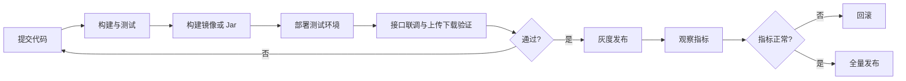

# 07 · 部署与运维

> 本文档描述 CloudChunk 当前可用的本地部署方式、运行端口、应用启动方式、监控入口与容量规划建议。

## 1. 环境依赖清单

| 组件 | 版本 | 用途 | 本地端口 |
|------|------|------|----------|
| JDK | 21+ | 后端运行时，启用虚拟线程 | - |
| Maven | 3.9+ | 后端构建 | - |
| Node.js / npm | 20+ / 10+ | 前端开发与构建 | 5173 |
| MySQL | 8.0 | 元数据持久化 | 3308 |
| Redis | 7.x | 分片进度、缓存、分布式锁、限流 | 6380 |
| RocketMQ NameServer | 5.2.0 | MQ 注册中心 | 9876 |
| RocketMQ Broker | 5.2.0 | 消息存储与投递 | 10909 / 10911 |
| RocketMQ Dashboard | latest | MQ 管理页面 | 8180 |
| MinIO | latest | 对象存储 | API 9002 / Console 9003 |
| FFmpeg | 6.x+ | 视频转码 | - |

## 2. docker-compose 本地环境

### 2.1 目录结构

```text
deploy/
├── docker-compose.yml
├── .env.example
├── sql/
│   └── schema.sql
├── redis/
│   └── redis.conf
└── rocketmq/
    └── broker.conf
```

### 2.2 服务清单

| 服务名 | 容器名 | 说明 |
|--------|--------|------|
| `mysql` | `cc-mysql` | 初始化 `cloudchunk` 数据库，并执行 `deploy/sql/schema.sql` |
| `redis` | `cc-redis` | 使用 `deploy/redis/redis.conf` |
| `rmq-namesrv` | `cc-rmq-namesrv` | RocketMQ NameServer |
| `rmq-broker` | `cc-rmq-broker` | RocketMQ Broker，挂载 `deploy/rocketmq/broker.conf` |
| `rmq-dashboard` | `cc-rmq-dashboard` | RocketMQ Dashboard |
| `minio` | `cc-minio` | MinIO API 与控制台 |

### 2.3 一键启动

```bash
docker compose -f deploy/docker-compose.yml --env-file deploy/.env.example up -d
```

查看状态：

```bash
docker compose -f deploy/docker-compose.yml ps
```

停止：

```bash
docker compose -f deploy/docker-compose.yml down
```

停止并清空数据卷：

```bash
docker compose -f deploy/docker-compose.yml down -v
```

## 3. 本地访问地址

| 服务 | 地址 | 默认账号 |
|------|------|----------|
| 后端 API | `http://localhost:8080/api/v1` | 开发环境用 `X-User-Id: 1` |
| Swagger UI | `http://localhost:8080/swagger-ui.html` | - |
| Actuator Health | `http://localhost:8080/actuator/health` | - |
| 前端 | `http://localhost:5173` | - |
| RocketMQ Dashboard | `http://localhost:8180` | - |
| MinIO Console | `http://localhost:9003` | `minioadmin / minioadmin` |

MinIO API 地址是 `http://127.0.0.1:9002`，这是应用配置中的 `MINIO_ENDPOINT` 默认值。

## 4. 应用配置

核心配置位于 `cloudchunk-boot/src/main/resources/application.yml`：

| 配置 | 当前默认值 | 说明 |
|------|------------|------|
| `server.port` | `8080` | 后端服务端口 |
| `spring.datasource.url` | `jdbc:mysql://127.0.0.1:3308/cloudchunk` | 本地 MySQL |
| `spring.data.redis.port` | `6380` | 本地 Redis |
| `rocketmq.name-server` | `127.0.0.1:9876` | 本地 RocketMQ |
| `cloudchunk.storage.type` | `minio` | 默认存储策略 |
| `cloudchunk.storage.default-bucket` | `cloudchunk` | 默认 bucket |
| `cloudchunk.storage.minio.endpoint` | `http://127.0.0.1:9002` | MinIO API |
| `cloudchunk.chunk.default-size` | `10485760` | 默认 10 MB 分片 |
| `cloudchunk.upload.auto-merge` | `true` | 分片完成后自动合并 |
| `cloudchunk.rate-limit.enabled` | `true` | 启用 Redis 令牌桶限流 |

完整配置项见 [11 配置参考](./11-configuration-reference.md)。

## 5. 启动方式

### 5.1 后端开发模式

```bash
mvn -pl cloudchunk-boot -am spring-boot:run -Dspring-boot.run.profiles=dev
```

PowerShell 可使用：

```powershell
mvn -pl cloudchunk-boot -am spring-boot:run "-Dspring-boot.run.profiles=dev"
```

### 5.2 Jar 包运行

```bash
mvn clean package -DskipTests
java -jar cloudchunk-boot/target/cloudchunk-boot.jar --spring.profiles.active=dev
```

### 5.3 前端开发模式

```bash
cd cloudchunk-web
npm ci
npm run dev
```

前端 Vite 代理已将 `/api` 转发到 `http://localhost:8080`。

## 6. 生产部署建议

### 6.1 配置与密钥

- 不使用默认密码，所有敏感配置通过 Secret 或配置中心注入。
- `MINIO_ENDPOINT` 使用 HTTPS 内网地址。
- RocketMQ 生产环境关闭自动创建 Topic，提前创建 Topic 与消费者组。
- MySQL、Redis、MinIO 与应用分离部署，并开启备份。

### 6.2 应用节点

CloudChunk 的 API 层是无状态服务，可多实例水平扩容。需要保证：

- 所有实例连接同一组 MySQL / Redis / RocketMQ / MinIO。
- 文件数据不落应用本地盘，除非显式使用 `local` 存储策略。
- 多实例下缓存失效依赖主动删除 + TTL 兜底；高一致性场景可扩展 Redis Pub/Sub 广播失效。

### 6.3 转码 Worker

当前 `cloudchunk-boot` 聚合了 `cloudchunk-transcode`，本地开发可直接运行。生产环境可按任务类型拆分独立 Worker：

| Worker | Topic / Tag | 扩缩容依据 |
|--------|-------------|------------|
| 图片转码 | `cloudchunk-transcode:img` | 图片任务积压、CPU |
| 视频转码 | `cloudchunk-transcode:video` | 视频队列长度、CPU、磁盘 IO |
| 文档转码 | `cloudchunk-transcode:doc` | 文档队列长度、CPU |

## 7. 监控与可观测

Actuator 暴露：

- `/actuator/health`
- `/actuator/info`
- `/actuator/metrics`
- `/actuator/caches`
- `/actuator/prometheus`

建议重点观测：

| 分类 | 指标 |
|------|------|
| 上传 | 分片上传耗时、MD5 校验耗时、合并耗时、失败率 |
| 下载 | 下载流量、Range 请求比例、416 数量 |
| 缓存 | FileMeta Caffeine 命中率、缓存大小、驱逐次数 |
| 限流 | 上传 / 下载限流拒绝次数 |
| 存储 | MinIO PUT / GET / Compose 耗时与失败率 |
| MQ | Topic 积压、消费失败率、重试次数 |
| JVM | 堆内存、GC、线程、虚拟线程任务积压 |

## 8. 容量规划参考

### 8.1 对象存储

估算公式：

```text
年存储量 = 日均上传量 × 365 × (1 - 秒传去重率) × 冗余系数
```

示例：日均上传 100 GB，秒传去重率 35%，冗余系数 1.2：

```text
100 × 365 × 0.65 × 1.2 ≈ 28.5 TB / 年
```

### 8.2 MySQL

| 表 | 主要增长来源 | 建议 |
|----|--------------|------|
| `file_meta` | 每个文件一行 | 重点优化 `file_md5 + status`、`owner_id + created_at` |
| `chunk_record` | 每个分片一行 | 大文件多时增长最快，可定期归档已完成记录 |
| `op_log` | 操作日志 | 建议按月归档或分表 |
| `transcode_record` | 转码任务 | 保留最近任务，历史结果沉淀到 `file_meta.extra` |

### 8.3 Redis

Redis 主要承载上传热状态和限流状态：

- 活跃上传越多，`cc:upload:progress:{fileId}` 越多。
- 所有上传会话必须设置 TTL，防止断网后遗留。
- URL 缓存和 FileMeta 缓存应设置短 TTL，避免长期占用。

## 9. 发布流程



## 10. 常见故障入口

| 问题 | 文档 |
|------|------|
| 容器启动失败、端口冲突 | [12 常见问题排障](./12-troubleshooting.md#2-端口冲突) |
| MySQL / Redis / MinIO 连接失败 | [12 常见问题排障](./12-troubleshooting.md) |
| 上传分片失败 | [12 常见问题排障](./12-troubleshooting.md#7-上传分片失败) |
| 合并失败 | [12 常见问题排障](./12-troubleshooting.md#8-合并失败) |
| 下载 Range 异常 | [12 常见问题排障](./12-troubleshooting.md#9-下载失败) |
| 转码无结果 | [12 常见问题排障](./12-troubleshooting.md#11-转码没有结果) |
