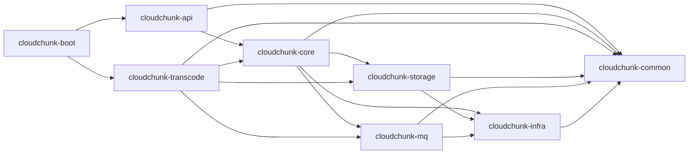

# 08 · 工程结构与命名规范

> 本文档定义 CloudChunk Maven 多模块结构、包命名、编码规范。

---

## 1. 模块划分

```
cloudchunk/                          # 根目录
├── pom.xml                          # 父 POM，聚合 + dependencyManagement
├── cloudchunk-common/               # 通用工具、常量、异常、DTO
├── cloudchunk-infra/                # 基础设施：Redis / MyBatis / Config
├── cloudchunk-storage/              # StorageStrategy 接口 + 三种实现
├── cloudchunk-mq/                   # RocketMQ 生产/消费封装
├── cloudchunk-core/                 # 核心领域：上传/下载/文件/秒传
├── cloudchunk-transcode/            # 转码 Worker（图/视/文）
├── cloudchunk-api/                  # Controller + DTO + OpenAPI
├── cloudchunk-boot/                 # 应用启动入口（聚合 api + core + transcode）
├── deploy/                          # 部署产物（docker-compose / k8s / SQL）
│   ├── docker-compose.yml
│   ├── sql/
│   │   ├── schema.sql
│   │   └── migration/
│   ├── k8s/
│   └── prometheus/
└── docs/                            # 设计文档（本文档集）
```

### 模块依赖关系



**规则**：
- 单向依赖，**禁止反向**
- `common` 为纯工具模块，**不依赖**任何其他模块
- `api` 不直接依赖 `storage` / `mq`，统一通过 `core` 聚合

---

## 2. 父 POM

```xml
<project>
    <modelVersion>4.0.0</modelVersion>
    <groupId>com.cloudchunk</groupId>
    <artifactId>cloudchunk</artifactId>
    <version>0.1.0-SNAPSHOT</version>
    <packaging>pom</packaging>

    <properties>
        <java.version>21</java.version>
        <maven.compiler.release>21</maven.compiler.release>
        <project.build.sourceEncoding>UTF-8</project.build.sourceEncoding>

        <spring-boot.version>3.3.4</spring-boot.version>
        <mybatis-plus.version>3.5.7</mybatis-plus.version>
        <rocketmq-spring.version>2.3.1</rocketmq-spring.version>
        <minio.version>8.5.11</minio.version>
        <thumbnailator.version>0.4.20</thumbnailator.version>
        <tika.version>2.9.2</tika.version>
        <hutool.version>5.8.28</hutool.version>
        <lombok.version>1.18.34</lombok.version>
    </properties>

    <modules>
        <module>cloudchunk-common</module>
        <module>cloudchunk-infra</module>
        <module>cloudchunk-storage</module>
        <module>cloudchunk-mq</module>
        <module>cloudchunk-core</module>
        <module>cloudchunk-transcode</module>
        <module>cloudchunk-api</module>
        <module>cloudchunk-boot</module>
    </modules>

    <dependencyManagement>
        <dependencies>
            <dependency>
                <groupId>org.springframework.boot</groupId>
                <artifactId>spring-boot-dependencies</artifactId>
                <version>${spring-boot.version}</version>
                <type>pom</type>
                <scope>import</scope>
            </dependency>
            <dependency>
                <groupId>com.baomidou</groupId>
                <artifactId>mybatis-plus-boot-starter</artifactId>
                <version>${mybatis-plus.version}</version>
            </dependency>
            <dependency>
                <groupId>org.apache.rocketmq</groupId>
                <artifactId>rocketmq-spring-boot-starter</artifactId>
                <version>${rocketmq-spring.version}</version>
            </dependency>
            <dependency>
                <groupId>io.minio</groupId>
                <artifactId>minio</artifactId>
                <version>${minio.version}</version>
            </dependency>
            <dependency>
                <groupId>net.coobird</groupId>
                <artifactId>thumbnailator</artifactId>
                <version>${thumbnailator.version}</version>
            </dependency>
            <dependency>
                <groupId>org.apache.tika</groupId>
                <artifactId>tika-core</artifactId>
                <version>${tika.version}</version>
            </dependency>
            <dependency>
                <groupId>cn.hutool</groupId>
                <artifactId>hutool-all</artifactId>
                <version>${hutool.version}</version>
            </dependency>
        </dependencies>
    </dependencyManagement>

    <build>
        <pluginManagement>
            <plugins>
                <plugin>
                    <groupId>org.springframework.boot</groupId>
                    <artifactId>spring-boot-maven-plugin</artifactId>
                    <version>${spring-boot.version}</version>
                </plugin>
            </plugins>
        </pluginManagement>
    </build>
</project>
```

---

## 3. 包结构（各模块）

### 3.1 `cloudchunk-common`

```
com.cloudchunk.common
├── constant/
│   ├── CommonConstants.java
│   ├── RedisKeys.java              # 集中管理所有 Redis Key 模板
│   └── MqTopics.java               # 集中管理所有 Topic/Tag
├── enums/
│   ├── FileStatus.java             # 0/1/2/3/4 → UPLOADING/MERGED/AVAILABLE/BROKEN/DELETED
│   ├── TranscodeStatus.java
│   ├── StorageType.java
│   └── UploadMode.java             # INSTANT/UPLOAD/RESUME
├── exception/
│   ├── BizException.java           # 业务异常基类
│   ├── ErrorCode.java              # 错误码枚举
│   └── specific/
│       ├── UploadException.java
│       ├── StorageException.java
│       └── TranscodeException.java
├── model/
│   ├── R.java                      # 统一响应封装
│   └── PageResult.java
├── util/
│   ├── Md5Utils.java
│   ├── IdUtils.java                # UUID 无横线
│   ├── MimeUtils.java
│   └── HexUtils.java
└── trace/
    ├── TraceContext.java           # MDC traceId 管理
    └── TraceFilter.java
```

### 3.2 `cloudchunk-infra`

```
com.cloudchunk.infra
├── config/
│   ├── MybatisPlusConfig.java
│   ├── RedisConfig.java
│   ├── JacksonConfig.java
│   └── VirtualThreadConfig.java
├── redis/
│   ├── RedisService.java           # 封装常用 Redis 操作
│   ├── RedisLock.java              # SETNX 分布式锁
│   └── RateLimiter.java            # Lua 滑窗限流
└── properties/
    └── InfraProperties.java
```

### 3.3 `cloudchunk-storage`

```
com.cloudchunk.storage
├── StorageStrategy.java            # 接口
├── StorageStrategyFactory.java
├── model/
│   ├── PutRequest.java
│   ├── PutResult.java
│   ├── GetRequest.java
│   ├── GetRangeRequest.java
│   ├── RangeStream.java
│   ├── ComposeRequest.java
│   ├── ComposeResult.java
│   └── ObjectStat.java
├── minio/
│   ├── MinioStorageStrategy.java
│   ├── MinioProperties.java
│   └── MinioStorageAutoConfiguration.java
├── local/
│   ├── LocalStorageStrategy.java
│   ├── LocalProperties.java
│   └── LocalStorageAutoConfiguration.java
└── oss/
    ├── AliyunOssStorageStrategy.java
    ├── OssProperties.java
    └── OssStorageAutoConfiguration.java
```

### 3.4 `cloudchunk-mq`

```
com.cloudchunk.mq
├── producer/
│   ├── TranscodeProducer.java
│   ├── ChecksumProducer.java
│   └── BrokenProducer.java
├── consumer/
│   ├── ChecksumConsumer.java
│   └── BrokenNotifyConsumer.java
├── message/
│   ├── TranscodeMessage.java
│   ├── ChecksumMessage.java
│   └── BrokenMessage.java
└── config/
    └── RocketMqConfig.java
```

### 3.5 `cloudchunk-core`

```
com.cloudchunk.core
├── file/
│   ├── entity/
│   │   └── FileMeta.java           # 对应 file_meta 表
│   ├── mapper/
│   │   └── FileMetaMapper.java
│   └── service/
│       ├── FileMetaService.java
│       └── impl/FileMetaServiceImpl.java
├── upload/
│   ├── entity/
│   │   ├── UploadSession.java
│   │   └── ChunkRecord.java
│   ├── mapper/
│   │   ├── UploadSessionMapper.java
│   │   └── ChunkRecordMapper.java
│   ├── service/
│   │   ├── UploadService.java          # 对外门面
│   │   ├── ChunkService.java           # 分片上传
│   │   ├── MergeService.java           # 合并
│   │   ├── InstantService.java         # 秒传
│   │   ├── ResumeService.java          # 断点续传
│   │   └── ChecksumService.java        # 异步校验
│   ├── dto/
│   │   ├── InitUploadRequest.java
│   │   ├── InitUploadResponse.java
│   │   ├── ChunkUploadRequest.java
│   │   ├── ChunkUploadResponse.java
│   │   └── MergeRequest.java
│   └── event/
│       ├── ChunkUploadedEvent.java
│       ├── AllChunksReadyEvent.java
│       └── MergeCompletedEvent.java
├── download/
│   └── service/
│       ├── DownloadService.java
│       └── RangeSpec.java
├── quota/
│   ├── entity/UserQuota.java
│   ├── mapper/UserQuotaMapper.java
│   └── service/QuotaService.java
└── audit/
    ├── entity/OpLog.java
    ├── mapper/OpLogMapper.java
    └── service/AuditService.java
```

### 3.6 `cloudchunk-transcode`

```
com.cloudchunk.transcode
├── consumer/
│   ├── AbstractTranscodeConsumer.java
│   ├── ImageTranscodeConsumer.java
│   ├── VideoTranscodeConsumer.java
│   └── DocTranscodeConsumer.java
├── ffmpeg/
│   ├── FFmpegExecutor.java
│   └── FFProbeParser.java
├── image/
│   └── ThumbnailGenerator.java
├── doc/
│   └── TikaExtractor.java
├── record/
│   ├── entity/TranscodeRecord.java
│   ├── mapper/TranscodeRecordMapper.java
│   └── service/TranscodeRecordService.java
└── config/
    └── TranscodeProperties.java
```

### 3.7 `cloudchunk-api`

```
com.cloudchunk.api
├── controller/
│   ├── UploadController.java
│   ├── FileController.java
│   ├── TranscodeController.java
│   └── QuotaController.java
├── dto/                            # Controller 入参/出参 VO
│   ├── upload/
│   ├── file/
│   └── transcode/
├── handler/
│   ├── GlobalExceptionHandler.java
│   └── ApiResponseAdvice.java      # 统一 R<T> 封装
├── filter/
│   ├── TraceFilter.java
│   └── AuthFilter.java
└── config/
    ├── OpenApiConfig.java          # springdoc
    └── WebConfig.java
```

### 3.8 `cloudchunk-boot`

```
com.cloudchunk
└── CloudchunkApplication.java      # @SpringBootApplication 主启动类

resources/
├── application.yml
├── application-dev.yml
├── application-prod.yml
├── logback-spring.xml
└── mapper/
    ├── FileMetaMapper.xml
    ├── ChunkRecordMapper.xml
    └── ...
```

---

## 4. 命名规范

### 4.1 类名

| 类型 | 后缀/前缀 | 例 |
|------|-----------|-----|
| 接口 | 无前缀 `I` | `StorageStrategy`（不是 `IStorageStrategy`） |
| 实现 | `Impl` / `Default` | `UploadServiceImpl` |
| Controller | `Controller` | `UploadController` |
| Service | `Service` | `UploadService` |
| Mapper（MyBatis） | `Mapper` | `FileMetaMapper` |
| DTO / 出入参 | `Request` / `Response` | `InitUploadRequest` |
| 实体 | 表名 CamelCase | `FileMeta`（对应 `file_meta`） |
| 枚举 | `Enum` 可省 | `FileStatus` |
| 异常 | `Exception` | `StorageException` |
| 工具 | `Utils` | `Md5Utils` |
| 配置 | `Config` / `AutoConfiguration` | `RedisConfig` |
| 配置属性 | `Properties` | `MinioProperties` |

### 4.2 方法名

- 查询：`get` / `find` / `list` / `page`
- 是否：`is` / `has` / `exists`
- 变更：`create` / `update` / `delete` / `save`
- 动作：动词开头，`upload` / `download` / `compose` / `merge`

### 4.3 常量

- `UPPER_SNAKE_CASE`
- Redis Key 模板集中在 `RedisKeys`，例：`UPLOAD_PROGRESS = "cc:upload:progress:%s"`
- 禁止魔法字符串，所有 Topic/Tag/ErrorCode 必须枚举或常量

### 4.4 包名

- 全小写，模块名对应 `com.cloudchunk.{module}`
- 功能域分子包：`upload`, `download`, `file`, `quota`
- 横切关注点单独包：`config`, `filter`, `handler`, `trace`

---

## 5. 编码规范

### 5.1 通用

- **Lombok**：允许 `@Getter @Setter @RequiredArgsConstructor @Slf4j @Builder`
- **禁止** `@Data` 实体类（会覆盖 `equals/hashCode`，影响 JPA/MP）
- **Java Record**：DTO / 值对象优先用 Record
- **Optional**：返回值语义上可能为空的 **必须** 返回 `Optional`；方法参数禁止 `Optional`

### 5.2 Controller

- 入参必须 `@Validated` + `jakarta.validation` 注解
- 返回统一 `R<T>`，由 `ApiResponseAdvice` 自动包装
- 错误分两类：**业务异常** `throw new BizException(ErrorCode.xxx)` / **系统异常** 由 `GlobalExceptionHandler` 兜底

### 5.3 Service

- 单方法行数 < 80
- 跨表/跨模块操作放 Service，不要在 Controller 组合
- 事务：`@Transactional(rollbackFor = Exception.class)`，**禁止**在单个事务内调用 MQ/远程服务

### 5.4 日志

- 入口日志（Controller / Consumer）：INFO 级
- 业务关键分支：DEBUG 级
- 失败：WARN / ERROR，必须带**业务 ID** 与**上下文**
- 不打印敏感数据（Token、文件内容）
- 模板：`log.info("upload chunk success: fileId={}, idx={}, etag={}", fileId, idx, etag);`

### 5.5 注释

- 类 Javadoc：一句话 + 职责
- 方法 Javadoc：非平凡方法必须写
- TODO / FIXME：必须带日期 + 责任人
- 设计说明用代码无法表达的，放到 `docs/` 而非代码注释

---

## 6. 测试

### 6.1 目录

```
src/test/java/com/cloudchunk/{module}
├── unit/                # 纯单元测试（不启 Spring）
└── integration/         # 集成测试（@SpringBootTest + Testcontainers）
```

### 6.2 框架

- JUnit 5
- AssertJ
- Mockito + mockito-inline
- Testcontainers（MySQL / Redis / MinIO / RocketMQ）

### 6.3 覆盖率目标

| 模块 | 覆盖率 |
|------|--------|
| core / upload | ≥ 80%（核心协议） |
| storage | ≥ 70% |
| api | ≥ 50%（Controller 主要覆盖集成测试） |
| transcode | ≥ 60% |
| 其他 | ≥ 50% |

---

## 7. Git 工作流

### 7.1 分支

- `main`：保护分支，只接 MR
- `develop`：集成分支（可选，小团队可省）
- `feature/xxx`：功能分支，完成后 MR 到 `main`
- `fix/xxx`：修复分支
- `release/x.y.z`：发布分支

### 7.2 Commit 规范（Conventional Commits）

```
feat(upload): 支持分片断点续传
fix(storage): 修复 MinIO compose 分片排序错误
docs(api): 补充错误码说明
refactor(transcode): 抽取 FFmpegExecutor
test(core): 添加秒传并发测试
chore(deps): 升级 spring-boot 3.3.4
perf(download): 预签名 URL 增加本地缓存
```

### 7.3 MR 要求

- 标题遵循 commit 规范
- 描述必须有 **背景 / 改动 / 测试方式 / 风险**
- 绑定 Issue
- 通过 CI（编译 + 单测 + 代码扫描）
- 至少一位 Reviewer 批准

---

## 8. 代码质量

| 工具 | 用途 |
|------|------|
| Checkstyle | 代码风格 |
| SpotBugs | 潜在 Bug |
| PMD | 代码坏味道 |
| JaCoCo | 覆盖率 |
| SonarQube（可选） | 综合质量门禁 |

集成至 CI，阻塞合并条件：
- 编译 / 单测失败 → Block
- 新增代码覆盖率 < 70% → Warn
- 新增 Critical / Blocker 问题 → Block

---

## 9. 起步脚手架清单

建议按以下顺序初始化：

- [ ] 创建父 POM + 各模块 `pom.xml`
- [ ] `cloudchunk-common`：ErrorCode / R / BizException / TraceFilter
- [ ] `cloudchunk-infra`：RedisService / MybatisPlusConfig
- [ ] `cloudchunk-storage`：StorageStrategy 接口 + MinIO 实现
- [ ] `deploy/sql/schema.sql` + docker-compose 启本地环境
- [ ] `cloudchunk-core.upload`：`/upload/init` + 秒传闭环
- [ ] `cloudchunk-core.upload`：分片上传 + Redis 进度
- [ ] `cloudchunk-core.upload`：合并 + MySQL 落表
- [ ] `cloudchunk-mq`：ChecksumProducer + ChecksumConsumer
- [ ] `cloudchunk-transcode`：ImageWorker（先图片，最简单）
- [ ] `cloudchunk-transcode`：VideoWorker + FFmpeg
- [ ] `cloudchunk-core.download`：基础下载 + Range
- [ ] `cloudchunk-api`：全部 Controller + OpenAPI
- [ ] 监控 / 日志 / 集成测试
- [ ] 前端 Demo（可选）
