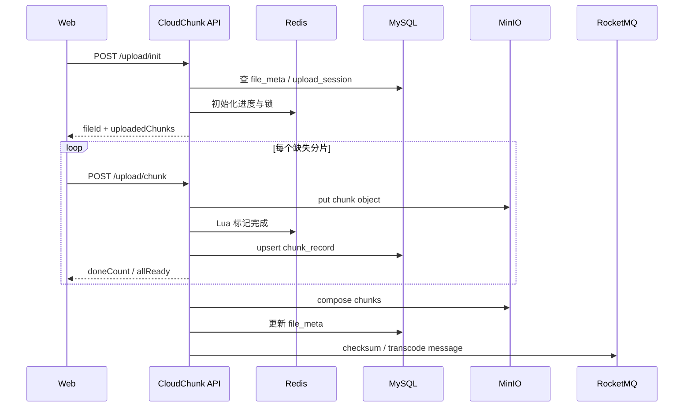

# 10 · 开发与联调指南

> 本文档面向第一次接手 CloudChunk 的开发者，目标是把本地后端、前端和依赖服务完整跑起来。

## 1. 环境要求

| 工具 | 建议版本 | 用途 |
|------|----------|------|
| JDK | 21+ | 后端运行时，启用虚拟线程 |
| Maven | 3.9+ | Java 多模块构建 |
| Node.js | 20+ | 前端开发 |
| npm | 10+ | 前端依赖管理 |
| Docker / Docker Compose | Docker 24+ | MySQL、Redis、RocketMQ、MinIO |
| FFmpeg | 6.x+ | 视频转码，本地调试转码链路时需要 |

## 2. 本地端口

`deploy/docker-compose.yml` 已避开常见本机端口冲突：

| 服务 | 宿主机端口 | 容器端口 | 访问地址 |
|------|------------|----------|----------|
| 后端 API | 8080 | 8080 | `http://localhost:8080/api/v1` |
| 前端 Vite | 5173 | 5173 | `http://localhost:5173` |
| MySQL | 3308 | 3306 | `127.0.0.1:3308/cloudchunk` |
| Redis | 6380 | 6379 | `127.0.0.1:6380` |
| RocketMQ NameServer | 9876 | 9876 | `127.0.0.1:9876` |
| RocketMQ Broker | 10909 / 10911 | 10909 / 10911 | `127.0.0.1:10911` |
| RocketMQ Dashboard | 8180 | 8080 | `http://localhost:8180` |
| MinIO API | 9002 | 9000 | `http://localhost:9002` |
| MinIO Console | 9003 | 9001 | `http://localhost:9003` |

## 3. 启动依赖服务

```bash
docker compose -f deploy/docker-compose.yml --env-file deploy/.env.example up -d
```

查看状态：

```bash
docker compose -f deploy/docker-compose.yml ps
```

首次启动时 MySQL 会自动执行 `deploy/sql/schema.sql`。如果你已经启动过容器并保留了卷，后续修改 schema 不会自动重放，需要手动执行 SQL 或重置卷：

```bash
docker compose -f deploy/docker-compose.yml down -v
docker compose -f deploy/docker-compose.yml --env-file deploy/.env.example up -d
```

## 4. 启动后端

### 4.1 Spring Boot 开发模式

```bash
mvn -pl cloudchunk-boot -am spring-boot:run -Dspring-boot.run.profiles=dev
```

PowerShell 中如果参数被解析异常，可以使用：

```powershell
mvn -pl cloudchunk-boot -am spring-boot:run "-Dspring-boot.run.profiles=dev"
```

### 4.2 打包运行

```bash
mvn clean package -DskipTests
java -jar cloudchunk-boot/target/cloudchunk-boot.jar --spring.profiles.active=dev
```

## 5. 启动前端

```bash
cd cloudchunk-web
npm ci
npm run dev
```

前端默认启动在 `http://localhost:5173`。Vite 已配置 `/api` 代理到 `http://localhost:8080`，所以浏览器侧请求仍然使用 `/api/v1`。

开发环境当前使用请求头 `X-User-Id: 1` 模拟登录用户，位置在 `cloudchunk-web/src/lib/api.ts`。

## 6. 健康检查

后端启动后可以用以下命令检查：

```bash
curl http://localhost:8080/api/v1/ping
curl http://localhost:8080/actuator/health
```

常用页面：

| 页面 | 地址 |
|------|------|
| Swagger UI | `http://localhost:8080/swagger-ui.html` |
| Actuator Health | `http://localhost:8080/actuator/health` |
| RocketMQ Dashboard | `http://localhost:8180` |
| MinIO Console | `http://localhost:9003` |

MinIO 默认账号密码来自 `deploy/.env.example`：

```text
minioadmin / minioadmin
```

## 7. 上传链路联调

### 7.1 前端上传

1. 打开 `http://localhost:5173`。
2. 拖拽或选择文件。
3. 前端计算整文件 MD5，调用 `/api/v1/upload/init`。
4. 对缺失分片调用 `/api/v1/upload/chunk`，默认走 `application/octet-stream` 高性能端点。
5. 分片全部完成后后端按配置自动合并，前端轮询或通过 WebSocket 获取进度。

### 7.2 后端接口顺序



## 8. 常用开发命令

| 命令 | 说明 |
|------|------|
| `mvn clean package -DskipTests` | 构建所有后端模块 |
| `mvn -pl cloudchunk-boot -am spring-boot:run` | 启动后端 |
| `npm --prefix cloudchunk-web run build` | 构建前端 |
| `docker compose -f deploy/docker-compose.yml logs -f minio` | 查看 MinIO 日志 |
| `docker compose -f deploy/docker-compose.yml logs -f rmq-broker` | 查看 RocketMQ Broker 日志 |
| `docker compose -f deploy/docker-compose.yml down` | 停止依赖服务 |
| `docker compose -f deploy/docker-compose.yml down -v` | 停止并清空依赖数据 |

## 9. 开发约定

- 后端接口统一使用 `/api/v1` 前缀。
- JSON 响应统一使用 `R<T>`：`code = 0` 表示成功。
- 文件数据路径优先走裸流 `application/octet-stream`，`multipart/form-data` 仅作为兼容入口。
- 跨模块调用通过 `cloudchunk-core` 聚合，Controller 不直接操作存储或 MQ。
- 修改配置、端口、Topic、Redis Key 后同步更新本文档和 [11 配置参考](./11-configuration-reference.md)。
