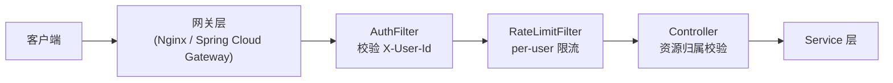

# 13 · 安全设计

> 本文档描述 CloudChunk 的鉴权、授权、资源隔离与安全防护机制。

---

## 1. 安全架构总览



| 层次 | 职责 | 实现 |
|------|------|------|
| 网关层 | TLS 终结、JWT 验签、注入 `X-User-Id` | Nginx / Spring Cloud Gateway（生产） |
| AuthFilter | 校验请求携带有效 userId | `com.cloudchunk.api.filter.AuthFilter` |
| RateLimitFilter | per-user 令牌桶限流 | `com.cloudchunk.api.filter.RateLimitFilter` |
| Controller | 资源归属校验（ownerId） | `FileController.checkFileOwnership()` |
| Service | 业务级权限（配额、会话所有者） | `UploadService.checkOwnership()` |

---

## 2. 认证（Authentication）

### 2.1 当前实现

```java
// AuthFilter.java — Order(5)，在 TraceFilter 之后、RateLimitFilter 之前
@Component @Order(5)
public class AuthFilter extends OncePerRequestFilter {

    @Value("${cloudchunk.auth.enabled:true}")
    private boolean authEnabled;

    private static final Set<String> WHITE_LIST = Set.of(
            "/actuator", "/v3/api-docs", "/swagger-ui", "/api/v1/health");

    @Override
    protected void doFilterInternal(...) {
        if (!authEnabled) { chain.doFilter(request, response); return; }
        // 白名单跳过
        for (String prefix : WHITE_LIST) {
            if (path.startsWith(prefix)) { chain.doFilter(request, response); return; }
        }
        // 校验 userId
        Long userId = UserContext.get();
        if (userId == null || userId <= 0) {
            reject(response); // 401
            return;
        }
        chain.doFilter(request, response);
    }
}
```

### 2.2 Filter 链顺序

```text
Order(HIGHEST)  → TraceFilter      设置 traceId + 从 Header 提取 userId
Order(5)        → AuthFilter       校验 userId 有效性
Order(10)       → RateLimitFilter  per-user 限流
```

### 2.3 开发 vs 生产

| 环境 | 配置 | 行为 |
|------|------|------|
| dev | `cloudchunk.auth.enabled=false` | 不校验，使用 `X-User-Id` header 模拟 |
| prod | `cloudchunk.auth.enabled=true` | 网关验签后注入 `X-User-Id`，AuthFilter 校验非空 |

### 2.4 生产演进方向

```text
当前：X-User-Id Header（网关注入）
  ↓
Phase 1：JWT Bearer Token（AuthFilter 内验签 + 提取 claims）
  ↓
Phase 2：Spring Security + OAuth2 Resource Server
```

---

## 3. 授权（Authorization）

### 3.1 资源归属校验

每个文件和上传会话都绑定 `ownerId`，操作时校验当前用户是否为所有者：

```java
// FileController.java
private void checkFileOwnership(FileMeta meta, long userId) {
    if (meta.getOwnerId() != null && meta.getOwnerId() != userId) {
        throw BizException.of(ErrorCode.FORBIDDEN, "not file owner");
    }
}

// UploadService.java
public void checkOwnership(UploadSession session, long currentUserId) {
    if (session.getOwnerId() != null && session.getOwnerId() != currentUserId) {
        throw BizException.of(ErrorCode.FORBIDDEN, "not session owner");
    }
}
```

### 3.2 受保护的操作

| 操作 | 校验 |
|------|------|
| 生成下载 URL | `checkFileOwnership` |
| 流式下载 | `checkFileOwnership` |
| 删除文件 | `checkFileOwnership`（通过 list 接口的 ownerId 过滤） |
| 上传分片 | 会话 ownerId 校验（隐含在 `requireRunningSession`） |
| 合并 | 会话 ownerId 校验 |
| 取消上传 | 会话 ownerId 校验 |

### 3.3 预签名 URL 的安全模型

```text
权限控制点 = "是否给你生成 URL"
  ↓
presigned URL 本身有签名 + 时效性（默认 30 分钟）
  ↓
拿到 URL 的人可以下载（类似 S3 设计）
  ↓
URL 过期后自动失效，无需额外撤销
```

---

## 4. 配额控制

```java
// QuotaService.java
public void checkCapacityOrThrow(long userId, long incrementBytes) {
    UserQuota q = getOrDefault(userId);
    if (q.getUsedBytes() + incrementBytes > q.getTotalBytes()) {
        throw BizException.of(ErrorCode.QUOTA_EXCEEDED, ...);
    }
}
```

- 上传初始化时**预检查**配额，快速失败
- 合并成功后**扣减**配额（事务内）
- 删除文件后**归还**配额

---

## 5. 限流防护

详见 [09 性能优化 · 第五节](./09-performance.md)。

| 端点 | 速率 | 突发 |
|------|------|------|
| 分片上传 | 30 rps/user | 60 |
| 下载 | 50 rps/user | 100 |

超限返回 `429 Too Many Requests`。

---

## 6. 输入校验

| 校验点 | 实现 |
|--------|------|
| 请求参数 | `@Valid` + Jakarta Validation |
| 分片大小 | `chunkSize ∈ [minSize, maxSize]` |
| 分片序号 | `chunkIndex ∈ [0, chunkTotal)` |
| 分片 MD5 | DigestInputStream 流式校验 |
| 文件名 | 长度限制 512 字符 |
| 分页参数 | `size ∈ [1, 100]` |

---

## 7. 防重放与幂等

| 场景 | 机制 |
|------|------|
| 秒传并发 | Redis SETNX `cc:upload:lock:{md5}` TTL 10min |
| 分片重复上传 | Redis HSETNX 原子幂等 |
| 合并并发 | Redis SETNX `cc:upload:merge-lock:{fileId}` + Watchdog |
| 转码重复消费 | Redis `cc:transcode:done:{fileId}:{type}` TTL 7d |

---

## 8. 数据安全

| 措施 | 说明 |
|------|------|
| 传输加密 | 生产环境 HTTPS（TLS 1.2+） |
| 存储加密 | MinIO 支持 SSE-S3 / SSE-KMS（按需开启） |
| fileId 不可预测 | UUID-32（128 bit 随机），不可枚举 |
| 预签名 URL 时效 | 默认 30 分钟，过期自动失效 |
| 日志脱敏 | 不打印文件内容、Token、密钥 |

---

## 9. 面试 Q&A

| 问题 | 回答要点 |
|------|----------|
| 用户鉴权怎么做的？ | 当前 Header 传 userId（网关注入），AuthFilter 校验；生产可升级 JWT |
| 怎么防止 A 下载 B 的文件？ | 下载接口校验 `meta.ownerId == currentUserId` |
| presigned URL 泄露了怎么办？ | 30 分钟自动过期；敏感场景可缩短 TTL 或加 IP 白名单 |
| 为什么不用 Spring Security？ | 当前是个人项目，轻量 Filter 足够；团队协作时建议升级 |
| 限流被绕过怎么办？ | 网关层加 IP 限流兜底；Redis 限流是应用层最后一道防线 |
