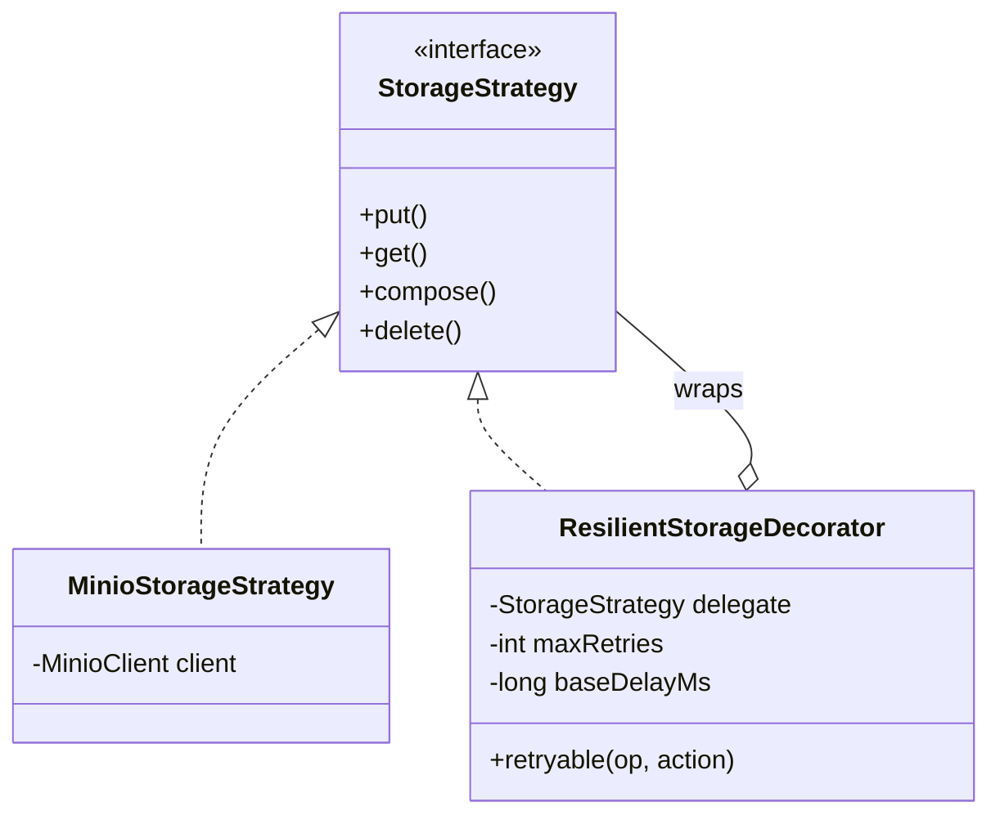

# 14 · 容错与弹性设计

> 本文档描述 CloudChunk 在存储层、分布式锁、过期资源清理、可观测性方面的容错机制。

---

## 1. 设计原则

| 原则 | 体现 |
|------|------|
| **故障隔离** | 存储层重试不影响上层业务逻辑 |
| **优雅降级** | Redis 不可用时 fallback 到 MySQL + MinIO 重建 |
| **幂等设计** | 所有写操作可安全重试 |
| **资源回收** | 过期会话定时清理，防止存储泄漏 |
| **可观测** | 关键路径暴露 Metrics，异常可告警 |

---

## 2. 存储层重试 — ResilientStorageDecorator

### 2.1 设计



### 2.2 重试策略

```java
// ResilientStorageDecorator.java
private <T> T retryable(String operation, Supplier<T> action) {
    for (int attempt = 0; attempt <= maxRetries; attempt++) {
        try {
            return action.get();
        } catch (StorageException e) {
            if (attempt < maxRetries) {
                long delay = baseDelayMs * (1L << attempt); // 指数退避
                log.warn("storage retry {}/{}: op={}, delay={}ms", attempt+1, maxRetries, operation, delay);
                Thread.sleep(delay);
            }
        }
    }
    throw lastException;
}
```

| 参数 | 值 | 说明 |
|------|---|------|
| maxRetries | 2 | 最多重试 2 次（总共 3 次尝试） |
| baseDelayMs | 100 | 首次重试等 100ms |
| 退避序列 | 100ms → 200ms | 指数增长 |

### 2.3 注册方式

```java
// MinioAutoConfiguration.java
@Bean
public StorageStrategy minioStorageStrategy(MinioClient client, StorageProperties props) {
    MinioStorageStrategy raw = new MinioStorageStrategy(client, props);
    return new ResilientStorageDecorator(raw, 2, 100);
}
```

### 2.4 面试要点

- **装饰器模式**：不修改原有代码，符合开闭原则
- **幂等安全**：PUT 用固定 key，CopyObject/Delete 天然幂等
- **防雪崩**：指数退避避免重试风暴

---

## 3. 分布式锁 Watchdog 续期

### 3.1 问题

合并大文件时 `ComposeObject` 可能耗时数十秒，固定 TTL 的锁可能在业务完成前过期，导致：
- 另一个请求获取到锁，触发并发合并
- 原持有者释放锁时 DEL 了别人的锁

### 3.2 解决方案

```java
// RedisLock.java
public LockHandle tryLockWithWatchdog(String key, String token, Duration ttl) {
    if (!tryLock(key, token, ttl)) return null;

    // 每 TTL/3 续期一次（Redisson 默认策略）
    long renewIntervalMs = ttl.toMillis() / 3;
    ScheduledFuture<?> future = watchdogScheduler.scheduleAtFixedRate(() -> {
        // Lua 原子续期：仅当 token 匹配时才 PEXPIRE
        redisService.raw().execute(RENEW_SCRIPT, List.of(key), token, String.valueOf(ttl.toMillis()));
    }, renewIntervalMs, renewIntervalMs, TimeUnit.MILLISECONDS);

    return new LockHandle(key, token, future);
}

// 使用方
var handle = redisLock.tryLockWithWatchdog(lockKey, token, Duration.ofMinutes(5));
try { return doMerge(s); }
finally { handle.unlock(); }  // 释放锁 + 停止续期
```

### 3.3 Lua 续期脚本

```lua
if redis.call('GET', KEYS[1]) == ARGV[1] then
    return redis.call('PEXPIRE', KEYS[1], ARGV[2])
else
    return 0
end
```

### 3.4 关键设计

| 设计点 | 说明 |
|--------|------|
| Daemon 线程 | `setDaemon(true)`，不阻塞 JVM 关闭 |
| `removeOnCancelPolicy` | 取消后立即从调度队列移除，避免内存泄漏 |
| Token 校验 | 续期时验证 token，防止续了别人的锁 |
| 自动停止 | `handle.unlock()` 先 cancel future 再 DEL key |

---

## 4. 过期会话清理

### 4.1 问题

用户上传中途放弃（关闭浏览器、网络断开），分片对象残留在 MinIO：
- 按 10MB/片 × 1000 片 = 10GB/会话，积累后存储成本巨大
- 当前只有被动拒绝（`requireRunningSession` 检查过期），没有主动清理

### 4.2 解决方案

```java
// SessionCleanupScheduler.java
@Scheduled(fixedDelay = 3600_000, initialDelay = 60_000)  // 每小时执行
public void cleanExpiredSessions() {
    LocalDateTime deadline = LocalDateTime.now().minusMinutes(60); // 宽限 1 小时

    List<UploadSession> expired = sessionMapper.selectList(
            new LambdaQueryWrapper<UploadSession>()
                    .eq(UploadSession::getStatus, UploadSessionStatus.RUNNING)
                    .lt(UploadSession::getExpireAt, deadline)
                    .last("limit 100"));  // 每批最多 100 条

    for (UploadSession s : expired) {
        // CAS 更新：只更新 RUNNING 状态的（幂等）
        int affected = sessionMapper.update(null, new LambdaUpdateWrapper<UploadSession>()
                .eq(UploadSession::getFileId, s.getFileId())
                .eq(UploadSession::getStatus, UploadSessionStatus.RUNNING)
                .set(UploadSession::getStatus, UploadSessionStatus.FAILED));
        if (affected == 0) continue;

        progressStore.clear(s.getFileId());
        cleanupPartsAsync(s);  // cleanupExecutor 异步删除
    }
}
```

### 4.3 两层保障

| 层次 | 机制 | 时效 |
|------|------|------|
| 应用层 | `SessionCleanupScheduler` 每小时扫描 | 过期后 1~2 小时清理 |
| 存储层 | MinIO Lifecycle Policy `parts/` 前缀 7 天过期 | 兜底，防止应用层遗漏 |

---

## 5. Redis 故障降级

### 5.1 进度重建

Redis 宕机恢复后进度丢失，`loadOrRebuildUploaded` 三层兜底：

```text
① Redis Hash（热路径，正常情况命中）
  ↓ 为空
② MySQL chunk_record（WHERE status=DONE）
  ↓ 取交集
③ MinIO list objects（确认对象确实存在）
  ↓
④ 重建 Redis Hash
```

### 5.2 限流降级

Redis 不可用时，`RateLimiter.tryAcquire()` 抛异常：
- 当前行为：请求被拒绝（保守策略）
- 可选优化：catch 异常后放行（宽松策略），依赖网关层限流兜底

---

## 6. 可观测性

### 6.1 Micrometer 指标全览

| 指标名 | 类型 | 描述 |
|--------|------|------|
| `cache.gets{cache=fileMeta, result=hit/miss}` | Counter | Caffeine 命中率 |
| `cache.size{cache=fileMeta}` | Gauge | 缓存条目数 |
| `cloudchunk.rate_limit.rejected{endpoint}` | Counter | 限流拒绝次数 |
| `cloudchunk.executor.available{name=io/cleanup}` | Gauge | 执行器可用许可 |
| `cloudchunk.executor.queue{name=io/cleanup}` | Gauge | 等待许可的线程数 |
| `cloudchunk.checksum.duration` | Timer | 整文件 MD5 校验耗时 |
| `cloudchunk.download.total` | Counter | 下载请求总数 |

### 6.2 StorageHealthIndicator

```java
@Component
public class StorageHealthIndicator implements HealthIndicator {
    @Override
    public Health health() {
        storageFactory.current().exists(bucket, "__health_check__");
        return Health.up()
                .withDetail("type", storageFactory.current().type())
                .withDetail("latencyMs", elapsed)
                .build();
    }
}
```

暴露在 `/actuator/health`，K8s 探针可依赖此端点：

```yaml
livenessProbe:
  httpGet:
    path: /actuator/health/liveness
    port: 8080
readinessProbe:
  httpGet:
    path: /actuator/health/readiness
    port: 8080
```

### 6.3 日志规范

```text
格式：%d [%X{traceId:--}] [%thread] %-5level %logger{36} - %msg%n
```

关键操作日志示例：
```text
2026-05-17 14:30:00.123 [abc123] [bvte-io-42] INFO  UploadService - merged fileId=xxx, key=..., etag=...
2026-05-17 14:30:01.456 [abc123] [bvte-io-42] INFO  ChecksumService - checksum completed: fileId=xxx, size=1024MB, elapsed=8500ms, throughput=120.5MB/s
```

---

## 7. WebSocket 背压保护

### 7.1 问题

慢客户端（弱网、后台 Tab）阻塞 `sendMessage`，导致其他订阅者的进度推送延迟。

### 7.2 解决方案

```java
// UploadProgressHandler.java
WebSocketSession decorated = new ConcurrentWebSocketSessionDecorator(
        session,
        5000,         // 发送超时 5 秒
        64 * 1024);   // 缓冲区上限 64KB
```

| 保护机制 | 行为 |
|----------|------|
| 发送超时 | 5s 内未发出 → 关闭连接 |
| 缓冲区溢出 | 积压 > 64KB → 关闭连接 |
| 线程安全 | 多个分片并发完成不会消息交错 |
| 自动清理 | 发送失败的 session 立即从 registry 移除 |

---

## 8. 故障恢复矩阵

| 故障场景 | 影响 | 恢复方式 |
|----------|------|----------|
| MinIO 短暂不可达（<1s） | 单次请求失败 | ResilientStorageDecorator 自动重试 |
| MinIO 长时间不可达 | 上传/下载全部失败 | StorageHealthIndicator 标记 DOWN，告警 |
| Redis 宕机 | 进度丢失、限流失效 | 进度从 MySQL+MinIO 重建；限流降级 |
| 合并锁过期 | 可能并发合并 | Watchdog 续期防止；即使并发，Compose 幂等 |
| 应用重启 | 进行中的合并中断 | 前端重试 `/merge`，锁 TTL 过期后可重新获取 |
| 过期会话堆积 | MinIO 存储浪费 | SessionCleanupScheduler + Lifecycle Policy |
| MQ 消费失败 | 转码延迟 | RocketMQ 重投 3 次 → 死信队列 → 人工重试 |

---

## 9. 面试 Q&A

| 问题 | 回答要点 |
|------|----------|
| MinIO 偶发超时怎么处理？ | ResilientStorageDecorator 装饰器，2 次重试 + 指数退避（100ms, 200ms） |
| 为什么用装饰器不直接改 MinioStorageStrategy？ | 开闭原则，不改原有代码；可以按需组合（如加监控装饰器） |
| 锁过期了业务没完成？ | Watchdog 每 TTL/3 续期，Lua 原子 PEXPIRE，业务完成后 unlock 停止续期 |
| 过期会话的分片怎么清理？ | 两层：应用层 @Scheduled 每小时 + MinIO Lifecycle 7 天兜底 |
| Redis 挂了进度丢了？ | MySQL chunk_record + MinIO list 取交集重建，三层兜底 |
| 怎么知道系统是否健康？ | StorageHealthIndicator + Executor Gauge + Caffeine stats，全部暴露给 Prometheus |
| WebSocket 慢客户端？ | ConcurrentWebSocketSessionDecorator 5s 超时 + 64KB 缓冲区，超限自动断开 |
